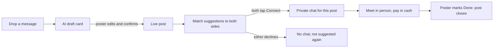

# Drop-a-Message Student Marketplace (Feature B)

## Summary

A student marketplace where a verified UMich student types one message ("selling a desk $25,
pickup by Aug 25", "arriving DTW Aug 20 3pm, anyone sharing a ride?"). AI turns it into a post the
student reviews before it goes live, and the post suggests matches to likely-interested verified
students. A private chat opens only when both sides tap Connect, so every conversation belongs to
one post. It covers furniture and essentials, housing, vehicles, and services and favors; services
lead the pilot, and the demo shows a furniture sale and a shared DTW ride on the same engine.

---

## Problem Frame

Students moving in or out of Ann Arbor already trade through WeChat-style group chats. Someone
posts in the group, interested people reply, the thread moves to a 1-to-1 chat, and the two meet at
the seller's place or somewhere public to swap the item for cash. The group feels safe because its
members are a known community, not random strangers.

The cost is attention and missed matches. Every post, reply and "still available?" lands in one
shared stream, so buyers scroll up and down to find anything, sellers repeat themselves, and a good
match is lost if the right person didn't open the chat that hour. Arriving students hit this at the
worst moment: jet-lagged, without a car, needing a ride from DTW, a bed and a desk in the same week.
Departing students have the mirror problem: a few days to offload furniture or a lease before they
leave.

UArrived's first-week journey (Feature A) already knows much of what a student needs (arrival date,
housing status, transport needs), but today nothing connects that knowledge to the people who can
help.

---

## Actors

- A1. Poster: a verified student who drops a message to sell, give away, offer, request or rent something.
- A2. Matched student: a verified student suggested to a post because one of their own live posts (usually a request) fits it.
- A3. AI assistant: turns messages and photos into structured posts, explains matches, suggests prices, flags missing information and risks. Never decides who is allowed to see or match a post.
- A4. Moderator: reviews reports, hides posts, blocks users.

---

## Key Flows

- F1. Sell or give away an item
  - **Trigger:** A1 types or pastes a message, optionally with photos.
  - **Actors:** A1, A3, A2
  - **Steps:** AI drafts a post (category, title, price or free, condition, availability dates, area) and suggests a price; A1 fixes anything wrong and confirms; the post goes live; AI suggests it to likely buyers and shows A1 who was suggested and why; both tap Connect; they chat and arrange a meetup.
  - **Outcome:** A1 marks the post Done; its open chats close and it leaves the feed.
  - **Covered by:** R1–R6, R8–R11, R15
- F2. Find a shared ride from DTW (pilot lead)
  - **Trigger:** A student's journey shows an upcoming arrival with no car; the "Plan your ride from DTW" task offers "Find students arriving the same day".
  - **Actors:** A1, A3, A2
  - **Steps:** The app pre-fills a ride post from the journey (arrival date and time window, DTW → Ann Arbor area); the student confirms or edits; AI suggests other students arriving in an overlapping window; both opt in; they chat and agree how to travel.
  - **Outcome:** Students share a ride; no money moves through the app.
  - **Covered by:** R4, R6–R9, R12, R16
- F3. Help me decide
  - **Trigger:** A student is weighing two or more posts, e.g. two sublets.
  - **Actors:** A2, A3
  - **Steps:** The student picks posts to compare; AI lists the facts side by side, names missing information, flags risk patterns, and suggests questions to ask the poster.
  - **Outcome:** The student asks better questions in chat; the AI makes no recommendation about eligibility or legality.
  - **Covered by:** R13, R14

---

## Requirements

**Posting**
- R1. A student creates a post by typing one free-text message, optionally with photos; there is no form to fill first.
- R2. AI turns the message into a draft with category, title, price or "free", availability dates, approximate area and (for housing) arrangement type, and marks any field it guessed.
- R3. Nothing goes live until the poster reviews the draft and confirms; the poster can edit every field. AI-written text is labeled AI-generated.
- R4. Supported categories: furniture and essentials, housing (sublet, roommate opening, lease assignment, new lease), vehicles, and services and favors (rides, moving help, storage). Services and favors are tuned first for the pilot.
- R5. AI suggests a price for items, labeled as a suggestion, with a one-line reason.

**Matching and connecting**
- R6. Each live post is suggested to verified students who are likely interested, using hard rules on category, dates, budget and area first, then relevance ranking.
- R19. Every post is either an offer ("selling a desk", "driving from DTW Aug 20") or a request ("looking for a desk under $50", "need a ride from DTW Aug 20"); AI infers which and the poster confirms it on the draft. A live request is the student's standing interest: there is no separate saved-search feature.
- R20. Matching runs both ways whenever a post goes live: a new offer is checked against live requests, and a new request against live offers. A student with no live request is reached only through the "For you" feed.
- R21. A student learns about a new suggestion through an in-app matches inbox with an unread badge, and by email to their verified @umich.edu address; several suggestions arriving close together are batched into one email, and email can be turned off in Profile.
- R7. Every suggestion carries a plain-language reason built only from facts on the post and the other student's stated needs (e.g. "arrives within 2 hours of you, both going to Central Campus").
- R8. A private chat opens only after both the poster and the matched student tap Connect. Declining hides that pairing for good; neither side is told the other declined.
- R9. Every chat is attached to exactly one post, and shows the post at the top.
- R10. The poster sees who their post was suggested to and can end suggestions at any time.
- R11. When the poster marks a post Done or it expires, it leaves the feed and suggestions, and its open chats are marked closed.

**Link to the first-week journey**
- R12. Journey data (arrival date, housing status, transport needs, move-in date) is used only to prompt a student and pre-fill a post they confirm; it is never used to match a student who has not posted.

**Browsing and deciding**
- R13. A ranked "For you" feed shows live posts ordered by relevance to the student; matches remain the primary surface and the feed is secondary.
- R14. "Help me decide" compares chosen posts side by side, lists missing information, flags known scam patterns, and suggests questions to ask; it never states that a post is safe or legitimate.

**Trust and safety**
- R15. Only verified UMich students can post, be matched, connect or chat, including admitted students before they arrive (see Outstanding Questions).
- R16. Safety guidance appears at the right moment: before a first meetup (meet in public, tell a friend), and for rides and in-home moving help, category-specific guidance.
- R17. Posts and chats can be reported, and users can be blocked, from inside a chat as well as from a post; reported content goes to a moderation queue.
- R18. Posts expire automatically (default per category) unless the poster renews them.

---

## Acceptance Examples

- AE1. **Covers R2, R3.** Given a student types "free twin mattress, north campus, gone by sat", when the draft appears, it shows category furniture, price free, area North Campus and an availability end date of the coming Saturday marked as guessed; nothing is live until the student taps Post.
- AE2. **Covers R6, R8.** Given a desk offer at $25 and a student whose live request has a $50 budget and a move-in week overlapping its availability, when the post goes live, both see the suggestion with its reason; no chat exists until both have tapped Connect.
- AE3. **Covers R8.** Given a suggestion where the matched student taps Decline, when the poster later views their suggestions, that student is no longer listed and no chat or notification about the decline is sent.
- AE4. **Covers R12.** Given a student whose journey says arriving Aug 20 with no car, when they open the DTW ride task, they are offered a pre-filled ride post; until they confirm it, they are not suggested to anyone.
- AE5. **Covers R11.** Given a post with three open chats, when the poster marks it Done, the post leaves the feed and suggestions and all three chats show it as closed.
- AE7. **Covers R19, R20, R21.** Given Mina has a live request "looking for a desk under $50, move in Aug 20", when Jae posts an offer "desk $25, pickup Aug 18–25", Mina's matches inbox shows the suggestion with a badge and she receives one email about it; a student with no live request gets no suggestion and no email.
- AE6. **Covers R7, R14.** Given a sublet post that states no lease dates, when a student asks Help me decide, the AI lists "lease dates missing" and suggests asking for them, and does not describe the post as safe.

---

## Success Criteria

- In the pilot, a student who drops a message gets at least one relevant suggestion, and a match leads to a chat, without the student scrolling any shared stream.
- Pilot students say they would use UArrived instead of, or before, their WeChat group for move-in and move-out trades and rides.
- The hackathon demo shows, on one engine, a furniture item posted and matched, and two arriving students matched for a DTW ride, meeting the brief's vertical slice.
- Planning can derive the post, match, connect, chat and close states and the safety rules from this doc without inventing product behavior.

---

## Scope Boundaries

- No payments, cost-splitting, deposits or escrow in the app; money changes hands in person.
- No lease signing, contract generation or legal advice; housing posts link to official guidance.
- No ratings or reviews in v1.
- No open group chat or public comment threads; conversation is only 1-to-1 per post.
- No matching from journey data without a confirmed post.
- No browser push notifications in v1 (in-app and email only).
- No nationwide or multi-campus marketplace; Ann Arbor and verified UMich students only.
- No precise addresses or live location; area-level location only.

---

## Key Decisions

- Drop-a-message input over a guided form: it matches how students already post in group chats. This replaces the form-first shape in issue #14.
- AI structures and explains, rules match: the brief requires deterministic, auditable matching, and explanations must only state true facts.
- Mutual opt-in to connect: removes unwanted messages and pressure at the cost of one extra tap.
- Verified UMich students only: recreates the "known community" safety of a WeChat group.
- Services and favors lead the pilot, with furniture in the demo: services tie directly into the first-week journey (DTW rides), and furniture keeps the brief's required slice.
- A "For you" feed exists but stays secondary: supports browsing without bringing back the scroll-the-group problem.

---

## Dependencies / Assumptions

- Depends on Feature A's student profile (arrival date, housing status, transport needs, move-in date) for R12 prompts and pre-fill.
- Assumption (unverified): admitted students can receive and verify an @umich.edu address before they arrive. The pilot's lead use case (arrival rides) depends on it.
- Assumption: posting in free text with AI structuring is accurate enough for pilot use when the poster always reviews the draft.
- Supersedes parts of existing issues #13–#17 (form-based posting, browse-first market); they need rewriting after planning.

---

## Outstanding Questions

### Resolve Before Planning

- (none)

### Deferred to Planning

- [Affects R15][Needs research] When do admitted UMich students get a working @umich.edu address? If it's after arrival for some, what fallback verification keeps pre-arrival ride matching possible?
- [Affects R18][Technical] Default expiry per category (e.g. rides expire after the arrival window; items after 14 days).
- [Affects R6, R13][Technical] How relevance ranking combines rule matches with AI similarity while keeping the rule filters auditable.
- [Affects R17][Needs research] Who moderates during the pilot, and how fast reports must be handled.
- [Affects R4][User decision, can wait] Whether vehicles need extra fields or warnings (title, registration) in v1 or only safety copy.
