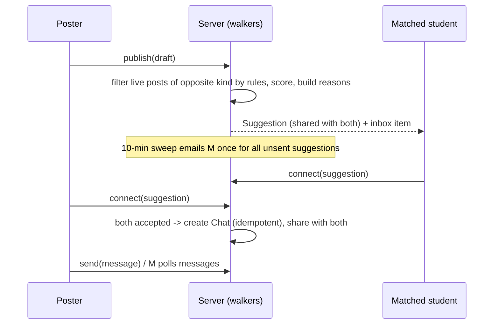

# feat: Drop-a-message student marketplace

## Summary

Build Feature B on a Jac full-stack web app: verified @umich.edu students drop one message, a
`by llm` function turns it into a typed offer-or-request draft, and deterministic walkers match
new posts both ways against live posts, notify matches in-app and by batched email, and open a
per-post chat only on mutual opt-in. Posts live on the shared graph; suggestions and chats are
shared with exactly their two students. Work lands in four phases: shared foundations, the
posting-and-matching engine, screens, then trust and safety.

---

## Problem Frame

Students trade and share rides through WeChat-style group chats, where every message competes in
one stream and matches are missed (see origin: docs/brainstorms/2026-09-26-001-drop-a-message-marketplace-requirements.md).
The repo today has only a placeholder `main.jac`, the design tokens in `ui/tokens.jac`, and folder
READMEs; the web-app shell, auth and shared model (issues #1, #2) do not exist yet, so this plan
has to lay them first.

---

## Requirements

Carried from origin (R-IDs match origin):

- Posting: R1 free-text message, R2 AI draft with guessed fields marked, R3 review before publish and AI label, R4 categories with services tuned first, R5 price suggestion, R19 offer vs request.
- Matching and connecting: R6 rule-first matching, R7 fact-only reasons, R8 mutual opt-in, R9 one chat per post, R10 poster sees and stops suggestions, R11 Done or expiry closes the post and its chats, R20 two-way matching, R21 in-app inbox plus batched email.
- Journey link: R12 prompt and pre-fill only.
- Browsing and deciding: R13 "For you" feed, R14 Help me decide.
- Trust and safety: R15 verified UMich only, R16 contextual safety guidance, R17 report and block from post or chat, R18 automatic expiry.
- Success criteria: a dropped message yields a relevant suggestion and chat without scrolling a stream; the demo shows a furniture item and a DTW ride on one engine.

**Origin actors:** A1 Poster, A2 Matched student, A3 AI assistant, A4 Moderator
**Origin flows:** F1 Sell or give away an item, F2 Find a shared ride from DTW, F3 Help me decide
**Origin acceptance examples:** AE1 (R2, R3), AE2 (R6, R8), AE3 (R8), AE4 (R12), AE5 (R11), AE6 (R7, R14), AE7 (R19, R20, R21)

---

## Scope Boundaries

Carried from origin: no payments, cost-splitting, deposits or escrow; no lease signing or legal
advice; no ratings or reviews; no open group chat or comment threads; no matching from journey
data without a confirmed post; Ann Arbor and verified UMich students only; area-level location
only; no browser push notifications.

Plan-local exclusions:
- No AI similarity in ranking; ranking is a rule-based score so every reason stays auditable.
- No real-time transport (websockets, SSE) for chat; polling.

### Deferred to Follow-Up Work

- Drafting a post from photos (R1/R2 photo input via `Image` in `by llm`): follow-up unit after the vertical slice; v1 drafts from text only, and posts may show no photos.
- AI-similarity ranking layered after the rule filter: after the pilot shows where rule scores miss.
- Rewriting issues #13–#17 to match this plan (they assume a form-first, browse-first market): right after the plan is accepted.
- Pre-arrival verification fallback if admitted students lack a working @umich.edu address (origin Outstanding Question): after the research answer; U1 isolates the verification method so a fallback slots in.

---

## Context & Research

### Relevant Code and Patterns

- `ui/tokens.jac`: the only source of colors, type, spacing; screens use `color()`, `text_style()`, `space()`.
- `scripts/check_rules.sh`: enforces Jac share ≥ 40%, non-Jac only in `interop/`, no `journey`↔`market` imports, no raw colors, no `ai/` import from rules code.
- `docs/ENGINEERING_RULES.md` and folder READMEs (`core/`, `journey/`, `market/`, `ai/`, `interop/`, `ui/`): ownership and boundaries.
- `jac create --kind web-app` scaffold (inspected in a scratch dir): `main.jac` entry importing `endpoints.jac` walkers and a client `frontend.jac`; walkers reached from the client with `root spawn`.
- Design canvas and system (Harbor/Arboretum/Nightfall; Today, Housing Hub, Market screens) as visual reference for U8.

### Institutional Learnings

- None recorded yet (`docs/solutions/` does not exist). `CLAUDE.md` notes two jaclang 0.37 gotchas: `glob` constants, and `int(s, 16)` failing under `jac test`.

### External References (version-matched `jac guide`, jaclang 0.37.23)

- jac-sv-auth: `:protect` is the authenticated endpoint; `:priv` is private and not served. Built-in email/password signup, `/user/send-verification`, `/user/verify-identity`.
- jac-sv-multi-user: shared commons `root.shared` + `grant(node, level=AccessLevel.READ)`; two-user sharing via `Jac.allow_root(node, other_root_id, level)` (import `JacRuntime as Jac`); grants are per node; `app_tokens` for single-use tokens.
- jac-sv-persistence: nodes reachable from a root persist (embedded Postgres); dangling nodes are lost; use `jid`/`jobj`, and `jobj` does not authorize.
- jac-by-llm: `def f(...) -> Obj by llm();` with `sem` descriptions; returns an `obj`, not a node; `MockLLM(outputs=[...])` for tests; model and key via `jac.toml` / env.
- jac-testing: `JacTestClient.from_file(..., base_path=tmp)` for multi-user tests; never name files `test_*.jac`; tests run in parallel; sharing only separates under the served client.
- jac-scale-scheduler: `@schedule(...)` fires only under `jac run --serve`, runs as the system user.
- jac-cl-routing / jac-fullstack-patterns: file-based `pages/`, `(auth)/` guarded group, `await` every server call, client reads are cached ~60s.

---

## Key Technical Decisions

- **Endpoints are `:protect` walkers/functions; nothing user-specific is `:pub`.** Per jac-sv-auth; the only `:pub` surface is signup/login and static pages.
- **Verification gate is a `Profile.verified` flag checked by every marketplace endpoint.** U1 first checks whether the server can read the built-in identity's `verified` flag; if it cannot, verification uses a 6-digit single-use code (`app_tokens`) sent by the `interop/` email helper. Either way the @umich.edu domain check happens server-side. A dev-only setting (off by default) auto-verifies when no SMTP is configured, for the demo.
- **Posts live on the shared commons with READ grants; ownership stays with the poster.** Suggestions and chats are separate nodes shared with exactly two roots via `allow_root`; chat messages hang off the chat node so one grant covers them where possible, and per-message grants otherwise (verified in U6 tests).
- **Matching is synchronous at publish time and pure-Jac, in a module that may not import `ai/`.** O(live posts in the category) per publish is fine for a pilot; `check_rules.sh` rule 5 extends to `market/matching.jac`.
- **Ranking is a transparent score from category fit, date-window overlap, budget fit and area proximity bucket; reasons are generated from the same facts that produced the score.** No LLM in reasons (R7).
- **Mutual opt-in is idempotent.** Each side writes only its own acceptance; whichever call observes both accepted creates the chat, and chat creation is keyed by the suggestion so a double-create returns the existing chat.
- **Expiry is evaluated on read (lazy), not by a job.** Defaults per category: rides and time-bound services end 24 hours after their window; items 14 days; housing 30 days; other services 7 days. A scheduled sweep is optional cleanup only.
- **Email batching uses a scheduled sweep every 10 minutes** that sends each recipient one email listing their unsent suggestions; the in-app inbox updates immediately. The sender is the single `interop/` Python file.
- **The journey → market link is a URL with pre-fill parameters**, not an import, so `journey/` never depends on `market/`.
- **Chat and inbox refresh by polling** a few seconds apart while the screen is open, invalidating the client read cache on writes.

---

## Open Questions

### Resolved During Planning

- How does an interested student learn about a post? Two-way matching against live requests, in-app inbox plus batched email (origin R19–R21, added during planning).
- Default expiry per category (origin deferred question): decided above.
- Ranking method (origin deferred question): rule score, AI similarity deferred.
- Who moderates in the pilot (origin deferred question, partly): moderators are listed by email in config; response time is an operational choice for the pilot team.

### Deferred to Implementation

- Whether the built-in identity `verified` flag is readable server-side (decides the U1 verification path).
- Exact grant pattern for chat messages (one grant on the chat vs per message), confirmed by U6's two-user tests.
- Whether a post created by the poster under `root.shared` stays editable only by the poster without an extra access policy; confirmed by U4 tests.
- Area proximity: fixed Ann Arbor area list (Central, North, South Campus, Kerrytown, Old West Side, Downtown, Other) vs anything finer; start with the list.
- Vehicles: extra fields or warning copy only (origin deferred, user decision that can wait); v1 ships warning copy only.

---

## Output Structure

    main.jac                      # entry: serves endpoints + client app
    jac.toml                      # web-app kind, byllm model, scheduler, emailer/moderators config
    pages/                        # thin route pages composing feature screens
    core/
      profile.jac                 # Profile/Student node, verification state, journey fields
      auth.jac                    # signup profile creation, umich domain check, verification
    market/
      graph.jac                   # Post, Suggestion, Chat, Message, Report, Block, Notification
      drafting.jac                # draft-to-post mapping around the ai/ call
      lifecycle.jac               # publish, done, renew, expiry, visibility
      matching.jac                # deterministic two-way matching + reasons (no ai/ import)
      connect.jac                 # opt-in, chat, messages
      notify.jac                  # inbox, email batching sweep
      moderation.jac              # reports, blocks, moderator queue
      screens/                    # compose, draft review, inbox, chat, feed, my posts, decide
      *.test.jac                  # test annexes
    ai/
      draft.jac                   # by llm: message -> PostDraft (offer/request, guessed fields)
      decide.jac                  # by llm: compare posts -> missing info, risks, questions
    interop/
      email_sender.py             # the only non-Jac file: SMTP send

---

## High-Level Technical Design

> *This illustrates the intended approach and is directional guidance for review, not implementation specification. The implementing agent should treat it as context, not code to reproduce.*

```mermaid
stateDiagram-v2
  [*] --> Draft: message dropped (AI structures)
  Draft --> Live: poster confirms
  Draft --> [*]: poster discards
  Live --> Live: matched both ways on publish; suggestions created
  Live --> Done: poster marks Done
  Live --> Expired: expiry passes (checked on read)
  Expired --> Live: poster renews
  Done --> [*]
```

Offer ↔ request pairing matrix (who gets suggested to whom):

| New post | Checked against | Suggestion goes to |
|---|---|---|
| Offer (item, room, ride seat, help) | live requests, same category | each matching requester and the poster |
| Request | live offers, same category | the poster and each matching offerer |
| Ride request (no car) | live ride requests on the same route and window, and ride offers | both sides (two riders can share a taxi) |

---

## Implementation Units

### Phase 1: Shared foundations (each lands as its own PR, approved by both feature leads)

### U1. Web-app shell, sign-up and UMich verification

**Goal:** A served web app where a student signs up with an @umich.edu address, verifies it, and only verified students reach marketplace endpoints.

**Requirements:** R15; issue #1

**Dependencies:** None

**Files:**
- Create: `jac.toml`, `pages/` (welcome, sign-in, verify), `core/auth.jac`
- Modify: `main.jac` (replace placeholder with the app entry), `README.md` (run commands), `.github/workflows/ci.yml` only if new test setup needs it
- Test: `core/auth.test.jac`

**Approach:**
- Scaffold with the web-app kind and fold its files into the existing layout; keep `ui/tokens.jac` as the styling source.
- Server-side domain check rejects any address not ending in `@umich.edu` (case-insensitive, no subdomain tricks such as `umich.edu.evil.com`).
- Implement the verification path decided at the start of this unit (built-in flag if readable server-side, else single-use code); set `Profile.verified` only through it.
- A shared guard used by every marketplace endpoint returns a clear "verify your UMich email" error for unverified callers.
- Dev auto-verify setting, off by default, logged loudly when on.

**Patterns to follow:** web-app scaffold layout; jac-sv-auth `:protect`; jac-cl-routing `(auth)/` guarded pages.

**Test scenarios:**
- Happy path: sign up `mina@umich.edu`, verify, call a guarded endpoint -> allowed.
- Error path: `mina@gmail.com` -> rejected at profile creation with a message naming UMich.
- Edge case: `MINA@UMICH.EDU` accepted; `mina@umich.edu.evil.com` and `mina@sub.umich.edu.org` rejected.
- Error path: signed in but unverified -> guarded endpoint refuses.
- Error path: a used or expired verification code -> rejected, still unverified (if the code path is chosen).
- Integration: dev auto-verify off by default; with it on, a new account is verified and the server logs a warning.

**Verification:** A new student can sign up, verify and land on an empty Today/market page; an unverified or non-UMich account cannot reach any marketplace endpoint.

### U2. Shared student profile

**Goal:** One `Profile` per student that the journey (Feature A) writes and the marketplace reads: display name, verified state, arrival date, housing status, move-in date, transport needs, area, email-notification preference, moderator flag.

**Requirements:** R12, R15, R21; issue #2

**Dependencies:** U1

**Files:**
- Create: `core/profile.jac`
- Test: `core/profile.test.jac`

**Approach:** Profile lives on the student's own root; expose `:protect` read/update of own profile only. Moderator flag comes from a configured email list, never user-editable. No marketplace types in `core/`.

**Test scenarios:**
- Happy path: update arrival date and housing status, read back.
- Error path: a student cannot update another student's profile, nor set their own moderator flag.
- Edge case: missing optional journey fields read as empty, not errors.

**Verification:** Both features can import the profile from `core/`; `check_rules.sh` passes.

### Phase 2: Posting and matching engine

### U3. AI drafting: message to offer-or-request draft

**Goal:** Turn one free-text message into a typed draft with kind (offer/request), category, title, price or free, availability window, area, arrangement type for housing, and which fields were guessed; plus a price suggestion with a one-line reason.

**Requirements:** R1, R2, R3 (AI label), R4, R5, R19; AE1

**Dependencies:** U2

**Files:**
- Create: `ai/draft.jac`, `market/drafting.jac`
- Test: `market/drafting.test.jac`

**Approach:**
- `ai/draft.jac` holds the `by llm` function and the draft `obj` with `sem` descriptions; it knows nothing about the graph.
- `market/drafting.jac` resolves relative dates ("by Sat") against today, clamps values (negative price -> guessed/empty), maps free-text area to the fixed area list, and marks AI-written text for the AI-generated label.
- A draft is not a post; nothing is stored until U4 publishes it.
- Model and key from config/env; a clear error when no key is set.

**Execution note:** Test-first with `MockLLM`; no test calls a real model.

**Test scenarios:**
- Covers AE1. "free twin mattress, north campus, gone by sat" -> offer, furniture, free, North Campus, end date next Saturday marked guessed.
- Happy path: "looking for a desk under $50, move in Aug 20" -> request, budget 50, window from Aug 20.
- Happy path: "arriving DTW Aug 20 3pm, anyone sharing a ride?" -> request, services/ride, window around 15:00 Aug 20, route DTW -> Ann Arbor.
- Edge case: housing message without arrangement type -> arrangement marked missing/guessed, not silently defaulted.
- Error path: mock returns unparseable output -> user gets "couldn't read that, try adding price or dates", no draft stored.
- Edge case: unknown area text -> area "Other", marked guessed.

**Verification:** Drafting works end to end with a mock and, manually, with a real key.

### U4. Post lifecycle and shared visibility

**Goal:** Publish a confirmed draft as a live post on the shared commons; poster can edit, mark Done, renew; expiry hides posts on read.

**Requirements:** R3, R11, R18; AE5

**Dependencies:** U3

**Files:**
- Create: `market/graph.jac` (Post and later node types), `market/lifecycle.jac`
- Test: `market/lifecycle.test.jac`

**Approach:** Post attached under `root.shared` with READ grant; only the poster may edit, mark Done or renew. Expiry defaults per category (Key Technical Decisions) computed at publish; every read filters out expired and Done posts. Marking Done closes the post's suggestions and chats (U5/U6 state) in the same operation.

**Test scenarios:**
- Happy path: publish -> second user sees it in a live-posts read.
- Error path: second user tries to edit or mark Done -> refused.
- Covers AE5. Post with three open chats marked Done -> leaves live reads; chats show closed.
- Edge case: post past expiry -> excluded from reads; renew -> visible again with a new expiry.
- Edge case: ride post expires 24h after its window regardless of the 7-day services default.
- Integration: two-user test via the served test client (sharing does not separate in plain scripts).

**Verification:** Posts appear to other verified students and disappear on Done or expiry.

### U5. Two-way deterministic matching with reasons

**Goal:** On publish, match the new post against live posts of the opposite kind (and ride-share requests against each other), create shared Suggestions with fact-only reasons and a score.

**Requirements:** R6, R7, R10, R20; AE2, AE7

**Dependencies:** U4

**Files:**
- Create: `market/matching.jac`
- Modify: `market/graph.jac` (Suggestion), `scripts/check_rules.sh` (rule 5 also covers `market/matching.jac`)
- Test: `market/matching.test.jac`

**Approach:**
- Hard filters: same category, opposite kind (ride requests also pair with each other), overlapping availability window, price within budget when both are known, not the same student, not blocked (U11), post not Done/expired.
- Score from window overlap, budget headroom, area bucket (same area > adjacent > other); keep top N per post.
- Reason text assembled from the matched facts only ("available during your move-in week", "within your $50 budget", "arrives within 2 hours of you").
- Suggestion shared with both roots; poster can stop suggestions for a post (R10), which removes pending ones.
- Pure function core (post pair -> match or not, score, reasons) so most tests need no server.

**Execution note:** Test-first on the pure matching function.

**Test scenarios:**
- Covers AE2. $25 desk offer vs request with $50 budget and overlapping move-in week -> match with reasons naming week and budget.
- Covers AE7. New offer reaches an existing live request; a student with no live request gets no suggestion.
- Edge case: request published after the offer -> matched on the request's publish (two-way).
- Edge case: windows touching at one endpoint count as overlap; windows one day apart do not.
- Edge case: price unknown on either side -> no budget filter, no budget reason.
- Error path: poster's own request never matches their own offer; blocked pair never matches.
- Happy path: two ride requests DTW -> Ann Arbor within 2 hours -> matched to each other.
- Integration: reasons never contain a fact absent from both posts (property-style check over the fixture set).

**Verification:** Publishing the demo fixtures yields the expected suggestions and reasons; `check_rules.sh` rejects an `ai/` import in `market/matching.jac`.

### U6. Mutual opt-in connect and per-post chat

**Goal:** Connect/decline on a suggestion; chat opens only when both accept; messages exchanged per post; closed with the post.

**Requirements:** R8, R9, R11; AE3

**Dependencies:** U5

**Files:**
- Create: `market/connect.jac`
- Modify: `market/graph.jac` (Chat, Message)
- Test: `market/connect.test.jac`

**Approach:** Each side records only its own acceptance; chat creation is idempotent per suggestion. Decline hides the pairing permanently without notifying the other side. Chat shared with exactly the two roots; messages readable/writable only by them. Closed chats are read-only.

**Test scenarios:**
- Happy path: A connects, then B connects -> one chat, both can send and read.
- Edge case: both connect at nearly the same time -> still exactly one chat.
- Covers AE3. B declines -> A's suggestion list no longer shows B; no chat; nothing sent to A about the decline.
- Error path: a third verified student cannot read or post to the chat, even with its id (`jobj` does not authorize; access check must).
- Error path: sending to a closed chat -> refused with "this post is closed".

**Verification:** Two test users can complete connect → chat; a third cannot see it.

### U7. Matches inbox and batched email

**Goal:** Unread-badged in-app inbox of suggestions; one email per recipient per sweep listing new suggestions; email opt-out.

**Requirements:** R21; AE7

**Dependencies:** U5, U2

**Files:**
- Create: `market/notify.jac`, `interop/email_sender.py`
- Modify: `jac.toml` (scheduler, SMTP settings via env)
- Test: `market/notify.test.jac`

**Approach:** Creating a suggestion creates an inbox item for the recipient immediately. A scheduled sweep every 10 minutes groups unsent items per recipient and sends one email through the interop sender, then marks them sent. Respects the Profile email preference. No email content beyond title, reason and a link (no chat text).

**Test scenarios:**
- Happy path: two suggestions for Mina within one window -> one email listing both; both marked sent.
- Edge case: email turned off -> inbox still updates, no email.
- Error path: SMTP failure -> items stay unsent and retry next sweep; inbox unaffected.
- Happy path: inbox unread count drops when Mina opens the suggestion.

**Verification:** With SMTP configured (or a test double), matches produce one batched email; `check_rules.sh` Jac share stays well above 40%.

### Phase 3: Screens

### U8. Market screens

**Goal:** Compose box, draft review card, matches inbox, chat, "For you" feed, my posts; built from `ui/components` and tokens, mobile-first.

**Requirements:** R1, R3, R9, R10, R13, R16 (placement); F1

**Dependencies:** U3–U7, and the `ui/components` base set from issue #3

**Files:**
- Create: `market/screens/` (compose, draft review, inbox, chat, feed, my posts), route pages under `pages/`
- Test: `market/screens.test.jac` for pure view helpers; manual/`/verify` browser pass for the UI

**Approach:** One compose box as the market's entry point; draft card shows guessed fields highlighted and an AI-generated label; confirm publishes. Inbox and chat poll while open. Feed ranks live posts by the U5 score against the viewer's live requests, falling back to newest. Match the design canvas screens.

**Test scenarios:**
- Happy path: helper that orders the feed ranks a matching post above a newer non-matching one.
- Edge case: viewer with no live requests -> feed is newest-first.
- Test expectation for layout: verified by a browser pass at 360 px and desktop widths, screenshot in the PR.

**Verification:** F1 works end to end in the browser as two users; `check_rules.sh` finds no raw colors.

### U9. Journey prompt with pre-filled ride post

**Goal:** The DTW ride task offers "Find students arriving the same day", opening compose with a pre-filled ride request from the profile.

**Requirements:** R12; F2; AE4

**Dependencies:** U8, U2 (and the Feature A task card once it exists)

**Files:**
- Modify: `journey/` task card for the DTW ride (or a stub until Feature A lands); `market/screens/` compose accepts pre-fill parameters
- Test: `market/screens.test.jac` (pre-fill parsing)

**Approach:** Link by URL with pre-fill parameters; `journey/` does not import `market/`. Nothing is posted until the student confirms.

**Test scenarios:**
- Covers AE4. Profile says arriving Aug 20, no car -> prompt shown; pre-filled draft has date and route; student not suggested to anyone until confirming.
- Edge case: malformed or missing pre-fill parameters -> empty compose, no error.

**Verification:** `check_rules.sh` shows no cross-feature import; the ride demo runs from the task card.

### Phase 4: Trust and safety

### U10. Help me decide

**Goal:** Compare 2–3 posts: facts side by side, missing information, known risk patterns, questions to ask; never declares a post safe.

**Requirements:** R14; F3; AE6

**Dependencies:** U4, U8

**Files:**
- Create: `ai/decide.jac`, `market/screens/` decide view
- Test: `market/decide.test.jac`

**Approach:** Facts table built deterministically from posts; missing-info list computed by rules (e.g. housing without lease dates); the `by llm` part only phrases risks and questions, labeled AI-generated. Output filtered so it never claims safety or legitimacy.

**Test scenarios:**
- Covers AE6. Sublet without lease dates -> "lease dates missing" listed and a question suggested; no "safe"/"legit"/"verified" wording.
- Edge case: comparing one post -> refused, needs at least two.
- Error path: LLM failure -> facts and missing-info still shown, AI section omitted with a note.

**Verification:** Decide view works with mocked and real models.

### U11. Safety copy, reports, blocks and moderation

**Goal:** Contextual safety guidance; report from post or chat; block a user; moderator queue to hide posts and block users.

**Requirements:** R16, R17

**Dependencies:** U6, U8

**Files:**
- Create: `market/moderation.jac`, safety copy in `ui/copy/`
- Modify: `market/matching.jac` and `market/connect.jac` (respect blocks), `market/graph.jac` (Report, Block)
- Test: `market/moderation.test.jac`

**Approach:** Safety text before a first meetup and on ride and moving-help posts; vehicles get warning copy. Reports go to a moderator queue visible only to moderators (U2 flag). Blocking removes existing suggestions, closes shared chats, and prevents future matches both ways. Hidden posts drop out of reads and matching.

**Test scenarios:**
- Happy path: report from a chat -> appears in moderator queue with post and chat reference.
- Error path: non-moderator requests the queue -> refused.
- Happy path: moderator hides a post -> it leaves the feed and matching.
- Edge case: A blocks B -> their shared chat closes, no new suggestions between them, B is not told.

**Verification:** Report, block and hide paths work across two or three test users.

---

## System-Wide Impact

- **Interaction graph:** publish triggers matching, suggestion creation, inbox items and later email; Done/expiry/block/hide must cascade to suggestions and chats.
- **Error propagation:** LLM, SMTP and scheduler failures degrade to "try again" or delayed email; they never lose a published post or a chat message.
- **State lifecycle risks:** dangling nodes are not persisted; every node must hang off a root or the shared commons. Double-connect races guarded by idempotent chat creation.
- **Access:** every marketplace endpoint is `:protect` plus the verified guard; `jobj` lookups are always followed by an ownership/grant check.
- **Unchanged invariants:** `journey/` and `market/` do not import each other; `ui/tokens.jac` stays the only color source; rules code does not import `ai/`.

---

## Risks & Dependencies

| Risk | Mitigation |
|---|---|
| Admitted students may lack a working @umich.edu before arrival, blocking the ride lead case | Verification isolated in U1; dev auto-verify for the demo; research follow-up listed in Deferred |
| Guides disagree on `:priv` vs `:protect` | Follow jac-sv-auth (checked against the live server); a U1 test proves unauthenticated calls are refused |
| Grants are per node; a missed grant shows as "other user sees nothing" | Every sharing unit (U4, U6) has a two-user served-client test |
| Scheduler fires only under `jac run --serve` | Lazy expiry needs no job; email sweep documented as serve-only; inbox works without it |
| LLM cost or outage during demo | Mocked in tests; drafting failure falls back to asking the user to add details |
| Python email helper erodes the Jac share | Single small file in `interop/`; CI Jac-share check |
| Issues #13–#17 describe a different market | Rewrite them after plan acceptance (Deferred) |

---

## Phased Delivery

1. **Foundations (U1, U2):** shared PRs, both leads approve; unblock Feature A too.
2. **Engine (U3–U7):** Feature B lead; mostly server-side with strong tests.
3. **Screens (U8, U9):** demo-ready vertical slice: furniture post and match, DTW ride share.
4. **Trust (U10, U11):** before real pilot users.

---

## Documentation / Operational Notes

- `README.md`: run commands for the served app, required env vars (LLM key, SMTP, serve secret), dev auto-verify warning.
- `.env.example`: variable names for the LLM key, SMTP credentials and the auth secret.
- Pilot: moderators' emails in config; a named person checks the moderation queue daily.

---

## Sources & References

- **Origin document:** [docs/brainstorms/2026-09-26-001-drop-a-message-marketplace-requirements.md](../brainstorms/2026-09-26-001-drop-a-message-marketplace-requirements.md)
- Rules: `docs/ENGINEERING_RULES.md`, `scripts/check_rules.sh`
- Tokens: `ui/tokens.jac`; design system and canvas artifacts (UArrived Design System, UArrived System Design)
- Related issues: #1, #2, #3 (foundations); #13–#17 (to rewrite); #18, #19 (trust)
- Jac guides (jaclang 0.37.23): jac-sv-auth, jac-sv-multi-user, jac-sv-persistence, jac-by-llm, jac-testing, jac-scale-scheduler, jac-cl-routing
