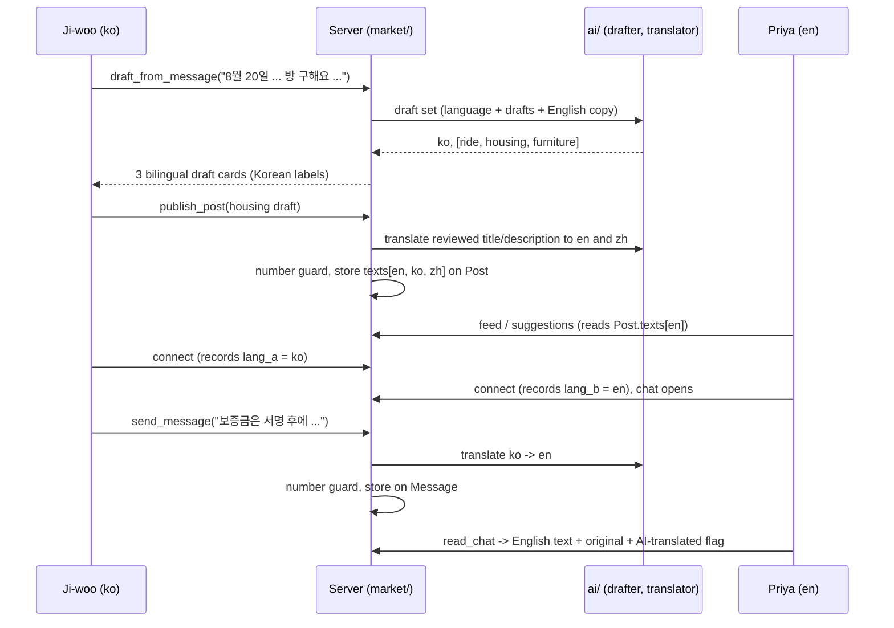

# feat: Native-language posting and chat in the marketplace

## Summary

Translate at write time and read stored text everywhere else. When a student drafts, the AI
detects the message's language, splits it into one draft per need, and writes an English copy.
When they post, the title and description are stored in English, Korean and Chinese. When they
send a chat message, it is translated once into the other student's language. Match reasons and
Help me decide are rendered in the reader's language: reasons from a fixed phrase table, AI
notes by translating the already-filtered English notes. A deterministic number check guards
every translation: if a number is lost, readers see the original.

---

## Problem Frame

International students think and write most comfortably in their own language, and the story in
the origin doc hinges on Ji-woo typing one Korean message in Seoul. Today the marketplace stores
one text per post and per message, match reasons are English strings, and the drafter returns a
single draft (see origin: `docs/brainstorms/2026-09-26-002-arrival-story-native-language-market-requirements.md`).

---

## Requirements

- R22. Any-language message; the AI detects the language (origin R22).
- R23. Draft card shows fields with labels in the poster's language plus the post text in their
  language and English (origin R23).
- R24. Price, dates, times and area stay structured values; translation never changes them (origin R24).
- R25. One message describing several needs yields separate drafts (origin R25).
- R26. Viewers see posts in their language with "See original" and an "AI-translated" label (origin R26).
- R27. Chat messages translated per reader, labeled, with "See original"; senders see their own words (origin R27).
- R28. Match reasons and Help me decide in the reader's language (origin R28).
- R29. Language set in Profile; first-run default is the first message's language (origin R29).
- R30–R32 (storyboard, prototype, components) were delivered as the demo artifact during the
  brainstorm and are not code work in this plan; proposed components are deferred below.

**Origin actors:** A1 Ji-woo (arriving student, writes Korean), A2 Marcus (English), A3 Priya
(English sublet poster), A4 Wei (writes Chinese), A5 AI assistant.
**Origin acceptance examples:** AE8 (R22, R23, R25), AE9 (R24, R26), AE10 (R27), AE11 (R28, R14).

---

## Scope Boundaries

- App chrome (buttons, menus, errors, safety tips) stays English in v1. Only content is
  localized, plus the small label set on the draft card and the translation controls.
- Pilot languages are English, Korean and Chinese (`en`, `ko`, `zh`). A post in any other
  language is accepted and translated into those three; readers whose setting is outside the
  set get English.
- Matching stays language-blind: rules read structured fields only (origin scope).
- No voice, image or lease-screenshot translation; no live call translation (origin scope).
- No translation of posts created before this change; they show their stored text as-is.

### Deferred to Follow-Up Work

- Full UI localization (a copy module for all screen strings): separate issue after the demo.
- Proposed marketplace components from the artifact (DraftCard, MatchCard, ChatBubble,
  CompareTable, PinnedPost, Market tab) moving into `ui/`: follow-up PR on the design-components
  line (origin Outstanding Questions).
- Asynchronous translation (send now, translate in the background): only if send latency hurts.
- A Profile screen that hosts the language setting (the Market-screen picker is a stand-in).

---

## Context & Research

### Relevant Code and Patterns

- `ai/draft.jac`: byLLM pattern. Model is a module glob (`drafter`) so tests swap it; function is
  `def ... -> Obj by drafter();` with `sem` strings as the prompt. No graph imports in `ai/`.
- `market/drafting.jac`: feature-side wrapper. `normalize()` validates and marks guessed fields;
  catches `OutputConversionError` (friendly error) and `ByLLMError` (falls back to `manual_card`,
  `ai_generated=False`). `DraftResult` carries one `draft`.
- `ai/decide.jac` + `market/decide.jac`: rules produce facts (`missing_info`, `risk_flags` via
  English keyword lists), AI produces `DecideNotes`, `clean_notes()` drops lines containing
  English `BANNED_CLAIMS`.
- `market/matching.jac` `match_pair()`: reasons are English f-strings stored on
  `Suggestion.reasons`; tests assert exact strings.
- `market/graph.jac`: `Post` (single title/description), `Suggestion` on `root.shared` with
  `accepted_a/accepted_b` written by each side, `Chat` (WRITE granted to both), `Message`
  (author owns, READ granted to the other root).
- `market/connect.jac`: `connect_to`, `ensure_chat`, `send` (creates `Message` and grants READ),
  `read_thread` → `MessageView{mine, text, sent_at}`.
- `market/lifecycle.jac`: `publish` / `edit` with `EDITABLE` whitelist; single `PostView` builder.
- `market/notify.jac`: email digest prints `s.reasons`.
- `core/profile.jac`: `Profile.preferred_language = "en"` already exists; `update_my_profile(changes)`
  whitelists it but does not validate the value. No screen edits it.
- `market/constants.jac`: import-free constants shared with client screens.
- Tests: `market/drafting_tests.jac`, `market/decide_tests.jac` swap `ai.draft.drafter` /
  `ai.decide.advisor` with `MockLLM(outputs=[...])`, `MockError(AuthenticationError(...))` for
  outages, `fake.sent("messages")` to check calls; served flows in `market/connect_flow_tests.jac`.

### Institutional Learnings

- No `docs/solutions/` yet. CLAUDE.md "Jac notes": client screens must import values only from
  import-free modules (E5082); omitted `str | None` params arrive as `"None"`; client reads cache
  60s and writes clear it; chat polls via `heartbeat()`.
- `docs/ENGINEERING_RULES.md`: rules code (`market/matching.jac`, `core/`) must not import `ai/`;
  every AI output is labeled; non-Jac only in `interop/`.

### External References

- None needed; byLLM usage and mocking are well established locally.

---

## Key Technical Decisions

- **Write-time translation, stored on the node its author owns.** Posts are translated in the
  poster's publish/edit request and stored on `Post`; chat messages are translated in the
  sender's `send` request and stored on `Message`. Readers never write, which fits the existing
  ownership (readers only have READ on posts and messages) and keeps polling free of AI calls.
- **The other student's language lives on the Suggestion.** Each side records its language when
  it taps Connect (each side already writes its own `accepted_*` flag), so `send` knows the
  target language without reading the other student's profile.
- **Reason codes, not AI, for match reasons.** `match_pair` also emits structured reason entries
  (a code plus values); a phrase table in `market/constants.jac` renders them in en/ko/zh. The
  English `reasons` strings stay as-is so existing tests and the digest keep working.
- **Help me decide: filter in English, then translate.** The advisor keeps producing English notes
  so `clean_notes` and `BANNED_CLAIMS` still work; the cleaned notes are then translated for the
  reader. `risk_flags` also scans a post's English copy, so a Korean or Chinese post still trips
  the English keyword lists.
- **Deterministic number guard outside `ai/`.** A translation is accepted only if every digit
  group in the source appears in the translation. On failure the translation is not stored, and
  readers see the original with no AI-translated label. The prompts ask the model to keep numerals
  as digits.
- **The draft's English copy is a preview only.** Publish ignores any English text sent by the
  client and translates the reviewed native title/description into every other pilot language,
  with the number guard on each, so a stale or edited preview can never go live.
- **Drafter returns a set, not one draft.** One call returns the detected language plus up to
  three drafts, each with an English title/description. `DraftResult` gains a `drafts` list and
  keeps `draft` (first item) so `ride_prefill` and existing callers still work.
- **Profile language: validated plus a "chosen" flag.** `preferred_language` is checked against
  the pilot set; a new flag records an explicit choice so the first-message default never
  overwrites it.
- **Pilot language list lives in `core/constants.jac`.** `core/profile.jac` validates against it
  without importing `market/`; `market/constants.jac` keeps the label and phrase tables. The
  `core/` changes ship as their own small PR approved by both feature owners
  (`docs/ENGINEERING_RULES.md` rule 6).
- **Every post has a source language.** Drafted posts use the detected code; manual-fallback and
  ride-prefill cards use the poster's profile language. Any well-formed 2–3 letter code is
  accepted as a source; non-pilot sources are translated into all three pilot languages.

---

## Open Questions

### Resolved During Planning

- Which model translates? The same `claude-haiku-4-5-20251001` default as drafting, via a separate
  `translator` glob so tests can swap it.
- How are translations cached? They are stored on the post or message at write time; there is no
  read-time cache to manage.
- Which languages? en, ko, zh for the pilot and demo.
- How are key facts extracted from other languages checked before the poster confirms (origin
  deferred question on R24)? The drafter extracts them as today, and a draft-time check marks a
  price, date or time field as guessed when its digits do not appear in the original message
  (e.g. "900불" supports $900; "8月21日" supports Aug 21). The poster reviews every guessed field.

### Deferred to Implementation

- Exact reason-code names and phrase wording in Korean and Chinese; have a native speaker on
  the team review the phrase table before the demo.
- Whether posts are translated in one AI call (all targets) or one call per target; decide
  after seeing MockLLM ergonomics and real latency.
- Whether the number guard should normalise full-width digits (e.g. "８") and thousands
  separators ("$1,200" vs "1200") before comparing.
- Whether Help me decide translates its notes in one batched call or line by line.

---

## High-Level Technical Design

> *This illustrates the intended approach and is directional guidance for review, not
> implementation specification. The implementing agent should treat it as context, not code
> to reproduce.*

---

## Implementation Units

### U1. Language constants, labels and reason phrases

**Goal:** One import-free home for the pilot languages, the draft-card and translation labels,
and the reason phrase table, usable by server and client code.

**Requirements:** R23, R26, R27, R28, R29

**Dependencies:** None

**Files:**
- Modify: `core/constants.jac` (pilot language list, display names, default)
- Modify: `market/constants.jac` (labels, reason phrases, flag and missing-info phrases)
- Test: `market/constants_tests.jac` (new)

**Approach:**
- Add the pilot language list with display names in each language, the default (`en`), and a
  label table per language: draft field labels (category, price, dates, time, area, route,
  arrangement), offer/request, "AI-translated", "See original", "Hide original", "Translating…",
  "Guessed, please check".
- Add a reason phrase table keyed by reason code with en/ko/zh templates containing named slots
  (e.g. minutes apart, price, budget, area, arrangement, route).
- Add Help me decide phrase tables: risk-flag codes and missing-info codes (including lease
  dates and the arrangement hint) with en/ko/zh text.
- A lookup helper returns English labels for any language outside the pilot set.
- Keep the module import-free (E5082).

**Patterns to follow:** existing globs in `market/constants.jac`; `core/constants.jac` header.

**Test scenarios:**
- Every language in the pilot list has every label key and every reason code (no missing keys).
- Every reason template for ko and zh uses exactly the same slot names as the English template.
- The English reason templates, filled with sample values, reproduce today's exact strings
  (e.g. "$25 is within the $50 budget", "Both in Central Campus").
- The English risk-flag and missing-info phrases reproduce today's `risk_flags` / `missing_info`
  strings.
- Label lookup for `fr` returns the English labels.

**Verification:** `jac check .` passes and a client screen can import the tables without E5082.

---

### U2. AI translator module

**Goal:** A byLLM translation helper in `ai/` with no graph knowledge.

**Requirements:** R22, R26, R27

**Dependencies:** None

**Files:**
- Create: `ai/translate.jac`
- Modify: `ai/README.md`

**Approach:**
- Module glob `translator` (same default model as `drafter`).
- One function translating a text from a source language to a target language, and one that
  translates a post's title and description to a list of target languages, returning plain objs.
- `sem` strings instruct: keep every numeral as digits, keep currency symbols, times and dates
  exactly as written, keep proper nouns and place names, and do not add or remove information.

**Patterns to follow:** `ai/draft.jac`, `ai/decide.jac`.

**Test scenarios:** Test expectation: none here -- behavior is tested through the market wrapper
in U3 with the model swapped for `MockLLM`.

**Verification:** `bash scripts/check_rules.sh` still passes (no `ai/` import from rules code).

---

### U3. Market translation wrapper with number guard

**Goal:** The single place the market calls translation: guard, fall back, and label results.

**Requirements:** R24, R26, R27

**Dependencies:** U1, U2

**Files:**
- Create: `market/translation.jac`
- Test: `market/translation_tests.jac` (new)

**Approach:**
- `digits_preserved(source, translated)`: every digit group in the source appears in the
  translation. Pure function, no AI.
- `translate_text(text, source, target)`: returns the original untouched when source equals
  target or the text is empty; otherwise calls the translator, applies the guard, and returns a
  result with text, ok flag and whether it is AI-translated.
- `translate_post_texts(title, description, source)`: returns a mapping language → {title,
  description} for all pilot languages, including the original under its own language. A failed
  target is left out, so readers of that language fall back to the original.
- Catches `OutputConversionError` and `ByLLMError` the same way `market/drafting.jac` does.
- `reader_language(lang)`: maps any value outside the pilot set to `en`.

**Patterns to follow:** error handling in `market/drafting.jac`; `MockLLM` swapping in
`market/drafting_tests.jac`.

**Test scenarios:**
- Happy path: ko → en with a mocked translation returns the English text flagged AI-translated.
- Same language: en → en makes no model call (`fake.sent("messages")` empty) and returns the original.
- Covers AE9. Guard: source "책상 $40, 8월 21–25일" with a mocked translation "Desk $40, Aug 21–25"
  fails because "8" is missing; the result is not ok and the original is returned.
- Guard pass: "900불 이하, 8월 20일" → "under $900, 8/20" passes.
- Outage: `MockError(AuthenticationError)` returns the original with ok false, no exception.
- Unparseable output returns the original with ok false.
- Post texts: a zh post yields entries for zh (original), en and ko; one failed target is omitted.
- `reader_language("fr")` returns `en`; `reader_language("ko")` returns `ko`.

**Verification:** all translation tests pass with no real model calls.

---

### U4. Language-aware multi-draft

**Goal:** One message becomes up to three drafts, each carrying the detected language and an
English title/description, validated like today.

**Requirements:** R22, R23, R24, R25; AE8

**Dependencies:** U1, U7 (profile "chosen" flag)

**Files:**
- Modify: `ai/draft.jac`
- Modify: `market/drafting.jac`
- Test: `market/drafting_tests.jac`

**Approach:**
- The drafter returns a set: detected language code plus a list of `PostDraft`, each with
  `title_en` and `description_en`. `sem` text: split distinct needs into separate drafts, at
  most three; keep numbers as digits; write title/description in the student's language and the
  English copy separately.
- `normalize` runs per draft unchanged; the wrapper maps the language through the pilot set
  (unknown codes kept for the poster, readers see English), trims to three drafts, and copies
  the English text into the original fields when the language is English.
- `DraftResult` gains `drafts` and `language`; `draft` stays as the first entry. The
  `ByLLMError` fallback returns one manual card as today. `ride_prefill` is untouched.
- If the student has not chosen a language (U7), the detected pilot language becomes their
  default.
- Key-fact check: after `normalize`, a price, date or time field whose digits do not appear in the
  original message is added to `guessed` (see Open Questions).
- The manual fallback card carries the poster's profile language.

**Patterns to follow:** existing `normalize` guessed-field logic and `mock()` helper in
`market/drafting_tests.jac`.

**Test scenarios:**
- Covers AE8. A mocked Korean set with ride, housing and furniture drafts returns three
  normalized cards, language `ko`, each with English text; the housing end date stays in
  `guessed`.
- A single-need English message returns one card whose English copy equals the original.
- A mocked set with five drafts is trimmed to three.
- A mocked unknown language code ("fr") is kept on the result; drafts still normalize.
- Outage returns one manual card, `ai_generated` false, as today.
- `draft` equals `drafts[0]` for existing callers.
- Key-fact check: a mocked Korean draft with price $900 from "900불" is not guessed; a mocked
  price $90 from the same message is marked guessed.
- An outage for a `ko` profile returns a manual card with language `ko`.
- The first draft by a student with no chosen language sets their profile language to `ko`; a
  student who chose `en` keeps `en`.

**Verification:** existing drafting tests pass alongside the new ones.

---

### U5. Stored post translations and localized post views

**Goal:** Posts store their language and texts in every pilot language, and every post view is
rendered for the reader.

**Requirements:** R24, R26, R28 (risk flags); AE9

**Dependencies:** U3, U4

**Files:**
- Modify: `market/graph.jac` (Post gains language and per-language texts)
- Modify: `market/lifecycle.jac` (publish/edit translate; `PostView` gains original text,
  language and AI-translated flag and is built for a reader language)
- Modify: `market/feed.jac`, `market/suggestions.jac` (pass the reader's language)
- Modify: `market/decide.jac` (`risk_flags` also scans the English copy; see U6 for notes)
- Test: `market/lifecycle_flow_tests.jac`, `market/decide_tests.jac`

**Approach:**
- `publish` accepts the draft's language (any well-formed 2–3 letter code; ride-prefill and
  manual cards fall back to the poster's profile language) and calls `translate_post_texts` on
  the reviewed native title and description; any client-sent English copy is ignored. `edit`
  re-translates only when title or description changed, and keeps today's `ai_generated=False`
  rule for poster edits.
- The view builder picks the reader's language text if present, else the original; it sets the
  AI-translated flag only when the text shown is not the original. Price, dates, times and area
  are copied from the structured fields as today and never from translated text.
- Posts without stored texts (created before this change) render as today.

**Patterns to follow:** `EDITABLE` whitelisting in `market/lifecycle.jac`; served flow tests.

**Test scenarios:**
- Covers AE9. A zh post "书桌椅子台灯 $40, 8月21–25日自取" viewed by a `ko` reader shows the Korean
  title, `$40` and Aug 21–25 from fields, the Chinese original, and the AI-translated flag.
- The same post viewed by its poster shows the Chinese text with no AI-translated flag.
- An `en` reader of an `en` post sees no flag and no original block.
- Editing only the price does not call the translator; editing the description does.
- A translation that failed the guard for `ko` makes a `ko` reader see the original with no flag.
- A post from before this change renders unchanged.
- An `fr` post is stored with en, ko and zh translations; an `en` reader sees English with the
  AI-translated flag.
- A manual card published by a `ko` profile is stored with source `ko` and translated to en and zh.
- A client-supplied `title_en` in the publish fields is ignored; the stored English comes from the
  translator.
- Covers AE11 (part). A ko sublet whose English copy says "wire the deposit before viewing" gets
  the payment risk flag.

**Verification:** feed, suggestions and Help me decide show localized post text in served tests.

---

### U6. Localized match reasons and Help me decide notes

**Goal:** Readers see match reasons and Help me decide notes in their language, still built by
rules or filtered in English first.

**Requirements:** R28; AE11

**Dependencies:** U1, U3, U5

**Files:**
- Modify: `market/matching.jac` (emit reason codes with values alongside English reasons)
- Modify: `market/graph.jac` (Suggestion stores reason codes)
- Modify: `market/suggestions.jac`, `market/notify.jac` (render reasons in the reader's or
  recipient's language)
- Modify: `core/profile.jac` (`Mailbox` gains the student's language; `sync_mailbox` runs when the
  language changes) — in the separate `core/` PR
- Modify: `market/decide.jac` (translate cleaned notes and fact labels for the reader)
- Test: `market/matching_flow_tests.jac`, `market/notify_tests.jac`, `market/decide_tests.jac`

**Approach:**
- Each place `match_pair` appends an English reason also appends a code plus values. Stored
  English strings remain for compatibility; rendering prefers codes when present.
- Rendering fills the phrase table from U1; an unknown code falls back to the stored English.
- Help me decide: the advisor still returns English, `clean_notes` runs first, then notes are
  translated with `translate_text`. `risk_flags` and `missing_info` also emit codes that render
  through the U1 phrase tables for the reader; the English strings stay for `summary_of`. The
  AI-generated label stays on the AI part.
- The email digest sweep never reads private profiles, so it renders reasons in the language
  copied onto each student's `Mailbox` (the same pattern `sync_mailbox` uses for email settings).
- `market/matching.jac` must not import `ai/` or `market/translation.jac` (rules boundary).

**Patterns to follow:** existing reason assertions in `market/matching.jac` tests;
`clean_notes` in `market/decide.jac`.

**Test scenarios:**
- A desk offer and request produce codes for dates-overlap, within-budget and same-area; a `ko`
  reader sees the Korean phrases with "$25" and "$50" filled in.
- An English reader sees exactly today's strings.
- The ride case "Times are 35 minutes apart" renders in Korean with 35.
- A suggestion stored before this change (no codes) renders its English reasons.
- Covers AE11. A `ko` reader comparing two sublets gets missing-info labels and the translated
  scam note in Korean, and no output contains a banned claim (the English filter runs first).
- A mocked advisor note "This listing is safe" is dropped before translation.
- Digest for a recipient whose mailbox language is `zh` lists reasons in Chinese; changing the
  profile language updates the mailbox.
- A `ko` reader sees the "deposit before viewing" risk flag and "lease dates missing" in Korean.
- `bash scripts/check_rules.sh` passes (matching imports no AI).

**Verification:** inbox, digest and Help me decide show reader-language text in tests.

---

### U7. Chat translation and profile language

**Goal:** Each chat message is translated once for the other student, and students can set their
language.

**Requirements:** R27, R29; AE10

**Dependencies:** U3

**Files:**
- Modify: `market/graph.jac` (Suggestion stores each side's language; Message stores the
  translated text, target language and AI-translated flag)
- Modify: `market/connect.jac` (`connect_to` records the caller's language; `send` translates for
  the other side; `read_thread` returns reader text plus original)
- Modify: `core/profile.jac` (validate `preferred_language` against the pilot list; add the
  "chosen" flag, set when the student changes it)
- Test: `market/connect_flow_tests.jac`, `core/profile_flow_tests.jac`

**Approach:**
- `connect_to` writes the caller's profile language to its side of the Suggestion, like its own
  `accepted_*` flag.
- `send` looks up the other side's language on the Suggestion, calls `translate_text`, and stores
  the result on the Message. A failed or skipped translation stores nothing extra.
- `read_thread`: for the sender, text is the original; for the reader, the stored translation if
  present, with the original and the AI-translated flag; otherwise the original.
- `ChatView.last_message` uses the same rule.
- Keep the 2000-character limit on the original. The translator's latency is paid by the sender.
- `update_my_profile` rejects codes outside `core/constants.jac`'s pilot list; the chosen flag is
  set whenever the student sends `preferred_language`. These `core/profile.jac` changes land in
  the separate `core/` PR.
- A Suggestion with no recorded language for the other side (connected before this change) means
  no translation: messages are stored and shown as written.

**Patterns to follow:** `accepted_a/accepted_b` writes in `connect_to`; `changes` whitelist in
`core/profile.jac`; served helpers in `market/connect_flow_tests.jac`.

**Test scenarios:**
- Covers AE10. Priya (`en`) sends "Can you do a video call Thursday 7pm EST?"; Ji-woo (`ko`) reads
  the mocked Korean translation with the original and the AI-translated flag; Priya's own view
  shows only her English text.
- Two English students: `send` makes no model call.
- Guard failure (translation drops "7") stores no translation; the reader sees the original.
- Translator outage: the message still sends; the reader sees the original.
- A student whose language changes after connecting: new messages use the language recorded at
  connect (documented behavior; re-connect is not required).
- `update_my_profile({"preferred_language": "xx"})` is rejected; `"zh"` is accepted and marks the
  language as chosen.
- `last_message` in the chat list shows the reader's text.
- A chat connected before this change (no recorded languages) sends and reads untranslated with
  no model call.

**Verification:** served chat flow tests pass with mocked translation; no real model calls.

---

### U8. Screens: bilingual drafts, See original, language picker

**Goal:** The client shows what U4–U7 return.

**Requirements:** R23, R25, R26, R27, R29

**Dependencies:** U1, U4, U5, U6, U7

**Files:**
- Modify: `market/screens/compose.jac` (one card per draft; field labels from the poster's
  language; English post preview; post or discard each)
- Modify: `market/screens/common.jac` (`PostSummary` shows AI-translated label and a See original
  toggle)
- Modify: `market/screens/chats.jac` (translated bubbles with label and See original)
- Modify: `market/screens/inbox.jac` (localized reasons; language picker in the header)

**Approach:**
- Labels come from the U1 tables via import-free `market/constants.jac` only.
- See original is local UI state per post or message; no server call.
- The picker calls `update_my_profile` with `preferred_language`, which also clears the client
  read cache so the next read is localized. It sits on the Market screen as a stand-in until a
  Profile screen exists (follow-up); R29's setting is the same profile field either way.
- Post and Send buttons are disabled and show "Translating…" while the request runs, so a slow
  translation cannot produce duplicate posts or messages.
- Each post, draft and message text block sets its accessible language to the language actually
  shown, so screen readers pronounce Korean and Chinese correctly inside the English app.
- Colors only from `ui/tokens.jac`; AI labels use the existing AI badge.

**Patterns to follow:** existing `Badge kind="ai"` and `guessNote` in
`market/screens/compose.jac`; polling in `market/screens/chats.jac`.

**Test scenarios:** Test expectation: none as unit tests -- the screens hold no logic beyond
rendering; covered by the manual browser pass below.

**Verification:** with `jac run --dev main.jac` and `jac browse`, walk the origin story with a
real key: Korean message → three bilingual drafts → post (button shows "Translating…" and cannot
be tapped twice) → an English account sees English text with See original → connect →
translated chat both ways → switch picker to 中文 and reload.

---

## System-Wide Impact

- **Interaction graph:** drafting, publish/edit, feed, suggestions, inbox badge, email digest,
  connect, chat send/read and Help me decide all change what they return; matching logic itself
  does not change.
- **Error propagation:** every translation failure degrades to the original text; no endpoint
  fails because the AI is down.
- **State lifecycle risks:** posts and messages created before the change have no language data
  and must keep rendering; Suggestions without reason codes render stored English.
- **API surface parity:** `DraftResult.draft` and `Suggestion.reasons` stay for existing callers.
- **Integration coverage:** served flow tests for publish → view as another language and
  connect → send → read.
- **Unchanged invariants:** matching rules, mutual opt-in, one chat per post, AI never decides
  who matches, AI output always labeled.

---

## Risks & Dependencies

| Risk | Mitigation |
|------|------------|
| Sending a message now waits for a translation call | Only when languages differ; Haiku is fast; async translation deferred as follow-up |
| The number guard rejects good translations (e.g. model writes "Aug" instead of "8") | Prompts require digits; fallback shows the original, which is safe; tune during implementation |
| Korean and Chinese phrase tables read unnaturally | Native-speaker review before the demo (deferred question) |
| Publishing costs two translation calls per post | Pilot scale is small; one-call batching is an implementation option |
| No real translation in CI | All tests use `MockLLM`; the manual browser pass in U8 uses a real key |

---

## Sources & References

- **Origin document:** `docs/brainstorms/2026-09-26-002-arrival-story-native-language-market-requirements.md`
- Base marketplace spec: `docs/brainstorms/2026-09-26-001-drop-a-message-marketplace-requirements.md`
- Base marketplace plan: `docs/plans/2026-09-26-001-feat-drop-a-message-marketplace-plan.md`
- Demo artifact (storyboard and prototype): https://claude.ai/artifact/XSdfbZpe8fj62A5ky8yy72
