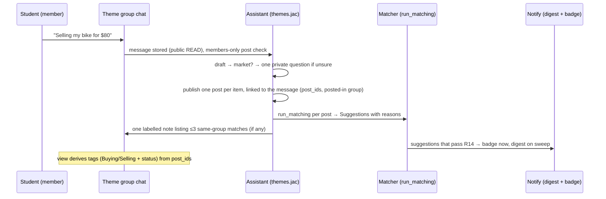

# feat: Themed group chats with Buying and Selling messages

## Summary

This plan replaces two things from #42/#43/#49:

- the arrival-month cohort groups;
- the AI-made per-item topic groups and their invites.

In their place comes a fixed, seeded set of themed group chats that every signed-in student can
read and join.

**Market messages.** A market message stays where it was written. The posts the assistant files
from it are linked to that message, and the chat shows **Buying / Selling** tags, facts and status
derived from those posts.

**Matching.** The existing matcher's suggestions drive two things:

- a one-time labelled note under the message, listing matches in the same group;
- private notifications about matches anywhere.

**Private chat.** "Message privately" opens a chat through the same one-sided suggestion pattern
the reply flow uses.

---

## Problem Frame

The shipped market moves buy/sell messages out of the conversation into invite-only topic groups
that nobody chose. Students expect to join a few interest groups and post "Selling my bike for $80"
inline, like any group message (see origin:
docs/brainstorms/2026-09-27-004-themed-group-chats-requirements.md).

---

## Requirements

Carried from the origin; IDs unchanged.

- **Groups.**
  - R1: a fixed, curated set of themed groups, each with a description and an icon.
  - R2: read-only preview; one-tap join; only members post; members can leave.
  - R3: the list shows joined groups first; up to 3 "Suggested for you"; nothing is auto-joined.
  - R4: cohort and topic groups and invites are retired.
- **Messages.**
  - R5: plain chat gets no assistant reply.
  - R6: tagged inline with its facts, no form.
  - R7: several items make several tags on one message.
  - R8: one private question; a sentence the assistant can't place stays chat.
  - R9: remove the tag, or mark it Sold / Found / No longer available; expired messages show
    Expired.
  - R10: tags are visually distinct and assistant content is labelled.
- **Connecting.**
  - R11: a one-time note under the message listing up to 3 matches in the same group, with
    reasons; no note if none.
  - R12: private notification (badge and digest) to matching students anywhere, once, respecting
    blocks.
  - R13: "Message privately" from any tagged message; the poster is told who started it.
  - R14: no notification for a same-category match without a stated fact.
- **Acceptance examples.** AE1–AE6 from the origin are covered in U2–U6's test scenarios.
- **Success criteria (origin).**
  - With the real model, a new student joins a group and posts "Selling my bike for $80", and it
    appears tagged within seconds.
  - AE1–AE6 hold in served tests and in a browser walk-through.
  - Plain chat is not tagged in the validation set.

---

## Scope Boundaries

- No cross-posting between groups.
- No student-created or AI-proposed groups, and no sub-groups.
- No in-group offers or holds.
- The Housing Hub is paused.
- No payments or lease signing.

### Deferred to Follow-Up Work

- Keeping the thread note live as new matches arrive (decided: written once at posting time).
- A hint when a tagged message is posted off-theme (origin default: none).

---

## Context & Research

### Relevant Code and Patterns

- `core/groups.jac`:
  - `ChatGroup`, `MemberOf`, the public `Membership` records, `join`, `leave`, `add_message`;
  - `GroupMessage` with `post_ids` (links from #49);
  - `now_precise`.
  - Cohort code (`cohort_key`, `sync_cohort`) and `LeftGroup` get retired.
- `market/topics.jac` (#49), which is mostly retired:
  - **reused:** the intent pipeline in `file_market` (`make_draft` → market or chat → the
    "unsure" rule → `blocking_question` → `fields_from` over every draft → `publish`),
    `answer_followup`, the message views, `links_for`, `groups_of_mine`, `leave_topic`;
  - **retired:** `topic_key` / `topic_name`, `ensure_group("topic", …)`, `file_post`,
    `invite_matches`, `Invite`, `InviteMark`, the invite endpoints.
- `market/items.jac`: standard items and `category_for`; unchanged.
- `market/matching.jac`: `run_matching` creates fact-based `Suggestion`s with reasons; `match_pair`.
- `market/messages.jac` `accept`: the one-sided "reply"-origin `Suggestion` (`post_b=""`, both
  accepted, open token, WRITE grant to the other root) plus `ensure_chat`. It's the pattern for
  "Message privately".
- `market/notify.jac`:
  - `pending_by_student` / `sweep`: the match digest;
  - `unread_count`: the badge;
  - `invite_sweep` and the invite part of `unread_count`: to remove.
- `core/auth.jac`: `confirm_verification` and `claim_umich_account` (#53) both call `sync_cohort`.
- Screens:
  - `market/screens/groups.jac` (`GroupList`, `GroupChat`, `GroupBubble`, `InviteCard`);
  - `market/screens/common.jac` (`MARKET_TABS`, `PostSummary`);
  - `market/screens/preview.jac` (design preview; imports `InviteView`);
  - `main.jac` routes `/market`, `/market/g`;
  - `ui/components` (#51 added Chip, SegmentedControl and others).
- Tests: `market/topics_tests.jac` (the served-scenario pattern, and its `ai_says` wrapping into
  `DraftSet`); `market/testkit.jac` (`served`).

### Institutional Learnings (CLAUDE.md)

- **Visibility.** Students see only their own edges, so anything others must count needs a public
  record.
- **Client code runs as JavaScript.** An empty list is truthy, so screens use `len()`.
- **Mocks.** The MockLLM only reaches the served app when the test file imports a server module.
- **Test runs.** Use `bash scripts/test.sh` (DB pooling off).
- **Timestamps.** Use `now_precise` for records that need ordering within one second.

---

## Key Technical Decisions

- **The theme catalog lives in import-free `market/constants.jac`.**
  - `THEMES`: each theme has a key, name, description, icon name and suggestion rule.
  - The groups are seeded on first use (idempotent `ensure_group("theme", key, …)`), so there's no
    migration step.
- **Messages become readable by every signed-in student (preview, R2).**
  - A group message gets a public READ grant, like posts, instead of `allow_group`.
  - Blocks still filter messages in the view.
  - Posting stays members-only, checked on the server.
- **Tags are derived when the chat is shown, never stored.** A message's tags come from its
  `post_ids`: kind → Buying/Selling; `post_status` → Sold / Found / No longer available / Expired /
  live; plus facts.
  - "Remove tag" withdraws those posts and sets an `untagged` flag on the message.
  - Posts filed from a message record the group they were posted in; this reuses the
    `topic_group_id` field, renamed in meaning to "posted in group".
- **The thread note is written once.**
  - Right after filing, the assistant takes that post's new suggestions whose other post was
    posted in the same group.
  - It writes one labelled note under the message with up to 3 of them.
  - The note is a group message with `ai=True` and `post_ids` of the matched posts, so the existing
    link rendering works.
- **Notifications reuse the suggestion digest and badge, with one new rule (R14):** a suggestion
  notifies only when it has at least one reason or both posts share a standard item other than
  "other". Invites are removed from the badge and the digest.
- **"Message privately" copies the reply-origin pattern**: a `direct`-origin `Suggestion` from the
  asker to the post's owner, both accepted, opened through `ensure_chat`. The chat list names the
  post, and the poster sees "<name> messaged you about <post>".
- **Tabs:** Groups / Matches / Chats / My posts. The For you page stays reachable, just not as a
  tab. The Matches list gets "Message privately" instead of Connect.
- **Module layout.**
  - `market/topics.jac` becomes `market/themes.jac`, which holds group listing, posting, tagging,
    notes and endpoints.
  - `market/topics_tests.jac` becomes `market/themes_tests.jac`.
  - Old dev data (cohort and topic groups, invites) is dropped. A dev-database reset is fine.

---

## Open Questions

### Resolved During Planning

- Matches and For you tabs: Matches stays as the notification landing page; For you leaves the
  tabs.
- Off-theme hint: none.
- Note freshness: written once.

### Deferred to Implementation

- Exact icon names per theme, from the `ui` icon set.
- Whether the `Suggestion` "direct" origin needs its own status rules in
  `market/suggestions.jac` (it should mirror "reply").
- Suggested-groups copy.

---

## High-Level Technical Design

*This illustrates the intended approach and is directional guidance for review, not implementation
specification. The implementing agent should treat it as context, not code to reproduce.*

---

## Implementation Units

### U1. Theme catalog, seeding, joining and preview

**Goal:** A fixed set of themed groups exists. Every signed-in student can list them, read any of
them, and join or leave. Cohort groups are gone.

**Requirements:** R1, R2, R3, R4.

**Dependencies:** none.

**Files:**
- Modify:
  - `market/constants.jac` (`THEMES`)
  - `core/groups.jac` (drop cohort code and `LeftGroup`; `add_message` grants public READ; keep membership helpers)
  - `core/auth.jac` (remove the `sync_cohort` calls from both sign-in paths)
- Create:
  - `market/themes.jac` (seeding; `list_groups` with joined / suggested / other; `join_group` / `leave_group`; preview-aware `group_view`)
  - `market/themes_tests.jac`
- Delete: `market/topics.jac`, `market/topics_tests.jac` (the reusable pieces move to `market/themes.jac`)
- Modify: `main.jac` (endpoint imports)

**Approach:**
- Seed all themes idempotently whenever the list or a group is requested.
- The list shows joined groups first (by latest activity), then the others in catalog order.
- Up to 3 groups get a `suggested` flag from the profile:
  - Housing & sublets if `housing_status == "looking"`;
  - Rides if `needs_airport_ride`;
  - then Move-out sales and Furniture;
  - never a group already joined.
- `group_view` works for non-members (read-only, `member=False`, no composer data).
- Posting checks membership on the server.

**Patterns to follow:** `ensure_group`, `groups_of_mine` and `leave_topic` from the old
`market/topics.jac`; the public `Membership` record pattern.

**Test scenarios:**
- Listing as a new student returns all 8 themes, none joined. Suggested are Move-out sales and
  Furniture, plus Housing & sublets when the profile says looking and Rides when an airport ride is
  needed, capped at 3.
- Join Furniture → it lists first with `member=True`. Leave → it drops back and `members` falls by
  one.
- Covers AE6: a non-member reads Textbooks messages (`member=False`, messages present). Posting as
  a non-member is refused.
- Two students list the groups at the same moment → still exactly one group per theme (seeding is
  idempotent).
- Signing in via `claim_umich_account` creates no cohort group and joins nothing.
- A blocked student's messages are hidden in preview too.

**Verification:** The group list shows 8 themes with correct suggestions. Preview and join/leave
work, and no cohort group appears anywhere.

---

### U2. Tagged market messages in the conversation

**Goal:** A buy or sell message stays in the chat, tagged Buying/Selling with its facts and status.
The sender can answer the one question, remove the tag, or close it.

**Requirements:** R5, R6, R7, R8, R9, R10.

**Dependencies:** U1.

**Files:**
- Modify:
  - `market/themes.jac` (posting: reuse the intent pipeline; publish every draft, link its posts to the message and record the group; derived `tags` on the message view; `answer_group_followup`; `untag_message`; `close_group_post`)
  - `core/groups.jac` (`GroupMessage.untagged`)
- Test: `market/themes_tests.jac`

**Approach:**
- Posting in a theme group runs the existing intent pipeline.
  - On success, the message's `post_ids` get the new posts, and each post records the group.
  - The sender sees a private notice for items that couldn't be filed or for dropped drafts,
    carried over from #49.
  - There is no cohort reply any more.
- Each message view carries `tags`: one per linked post, with kind label, item title, facts line
  and status label, derived from `post_status` and `closed_reason`.
- `untag_message` works only on the author's own message: it withdraws the linked posts and sets
  `untagged`, and the view then shows no tags.

**Patterns to follow:**
- `file_market`, `answer_followup` and `view` in the old topics module;
- `facts_line`, `PostSummary` and `finish` for closing.

**Test scenarios:**
- Covers AE1 (tag part): "Selling my IKEA desk $30" → the message shows one Selling tag: Desk ·
  $30 · live.
- Covers AE3: "desk" → the question goes only to the sender. Other members see a plain message.
  After the answer "kind:request", the tag shows Buying.
- Covers AE4: "Anyone else arriving on the 20th?" → no tag and no assistant message.
- Several items: bike, lamp, mattress drafts → one message with three tags.
- Covers AE5: marking the desk sold → the tag shows "Sold".
- "It's just chat" → the tag disappears and the post is withdrawn. Another student can't untag
  someone else's message.
- An expired post → the tag shows "Expired" (`UARRIVED_TODAY` moved forward).
- Without AI, "Selling my bike $80" gets the question path, then the tag appears after the answers.

**Verification:** In served tests, tags appear, change status and disappear as specified, and plain
chat stays untagged.

---

### U3. Thread note and notification rules

**Goal:** Matches in the same group appear as one labelled note under the message; matches anywhere
notify privately.

**Requirements:** R11, R12, R14.

**Dependencies:** U2.

**Files:**
- Modify:
  - `market/themes.jac` (after filing: collect the new suggestions whose other post was posted in the same group; write one assistant note with up to 3, each with a reason)
  - `market/notify.jac` (remove invites from the badge and digest and delete `invite_sweep`; add the R14 filter to `pending_by_student` and `unread_count`; the digest links to the message's group)
- Test: `market/themes_tests.jac`, `market/notify_tests.jac`

**Approach:**
- The note text names each match's poster and reason ("Mina is looking for this: $30 is within the
  $40 budget"). Its links come from `post_ids`, and it's rendered as an assistant bubble.
- No suggestions in the same group → no note.
- The R14 filter: a suggestion counts toward the badge and digest only when it has at least one
  reason, or both posts share a standard item other than "other".

**Test scenarios:**
- Covers AE1: Mina has an open "Looking for a desk, up to $40" in Furniture; Jae posts "Selling my
  IKEA desk $30" there. A note under Jae's message names Mina with the budget reason and links to
  her message.
- Covers AE2: Kai's "Looking for a bike" is in Bikes & vehicles; Lee posts "Selling my bike $80" in
  Move-out sales. Kai's badge goes up by 1 and the digest lists Lee's message with the reason. Lee's
  message has no note, because Kai's post is in another group.
- No match → no note.
- More than 3 same-group matches → the note lists 3.
- A blocked pair → no note mention and no notification.
- A same-category pair with no reason and different items (e.g. both furniture, "other" items) →
  no notification (R14).
- The digest runs twice → one email (the existing once-only rule holds).

**Verification:** AE1 and AE2 pass in served tests, and invite code is gone from `notify.jac`.

---

### U4. Message privately

**Goal:** Anyone can open a private chat with a tagged message's poster in one tap.

**Requirements:** R13.

**Dependencies:** U2.

**Files:**
- Modify:
  - `market/themes.jac` (`message_poster(post_id)` endpoint)
  - `market/connect.jac` (the chat view names a direct chat by its post and who started it)
  - `market/suggestions.jac` (status rules for `direct` origin, mirroring `reply`)
- Test: `market/themes_tests.jac`

**Approach:**
- Find or create a `direct`-origin suggestion (post_a = the post, root_a = the poster, root_b = the
  asker, both accepted), share it WRITE with the poster, then `ensure_chat`. One chat per asker per
  post.
- Refused on your own post, on a closed post, and when either side has blocked the other.

**Patterns to follow:** `accept` in `market/messages.jac` (reply-origin suggestion plus
`ensure_chat`).

**Test scenarios:**
- Mina taps "Message privately" on Jae's desk → a chat opens; both see it in Chats; Jae's list
  shows "Mina messaged you about Desk".
- A second tap returns the same chat.
- Own post → refused.
- A sold post → refused with "This message is closed."
- Blocked → refused.

**Verification:** Private chats open from a tagged message and work like existing chats.

---

### U5. Screens

**Goal:** The group list and group chat match the new model.

**Requirements:** R1–R3, R6, R9–R11, R13, AE6.

**Dependencies:** U1–U4.

**Files:**
- Modify:
  - `market/screens/groups.jac`:
    - group list: joined, suggested and other groups, each with icon, description, member count, latest activity and Join;
    - group chat: tag chips on messages (Buying/Selling plus status) with the facts line;
    - owner controls (Sold/Found, No longer available, It's just chat);
    - "Message privately" on others' tagged messages;
    - labelled assistant notes with links;
    - preview mode with a Join bar instead of the composer;
    - Leave in the group menu (two-tap confirm kept);
    - remove the invite UI.
  - `market/screens/common.jac` (`MARKET_TABS`: Groups / Matches / Chats / My posts)
  - `market/screens/inbox.jac` (Matches: "Message privately" replaces Connect)
  - `market/screens/preview.jac` (drop `InviteView`, show a theme list sample)
  - `main.jac`

**Approach:**
- Reuse `ui/components` (Chip for tags, Badge "Assistant", Card, Button, and #51's
  SegmentedControl if useful).
- Tags use existing tokens only (repo rule: no raw colors).
- Keep `len()` checks for lists in client code.

**Test expectation:** covered by served tests of the endpoints (U1–U4) and the browser walk-through
in U6. No screen unit tests.

**Verification:** `jac check` passes and the client bundle builds (the served app loads `/market`).

---

### U6. Validation with the real model and the browser

**Goal:** Prove the success criteria end to end.

**Requirements:** Success criteria; AE1–AE6.

**Dependencies:** U5.

**Files:** none new. A scratch scenario script outside the repo; the PR description records the
results.

**Approach:**
- Serve the app with the real model.
- Scripted scenarios: AE1, AE2, AE4, the multi-item message, and a plain-chat set ("hi",
  "anyone arriving on the 20th?", "where do I get a SIM card?"). Run them twice.
- Browser walk-through:
  - a new student sees suggestions, previews Move-out sales, joins, posts "Selling my bike for
    $80", sees the Selling tag and a note;
  - a second student taps Message privately;
  - the owner marks it sold;
  - the owner leaves the group.

**Test expectation:** none new; this unit runs the app.

**Verification:** Every scripted scenario gives the expected tag, note and notifications on two
runs, and the walk-through works without errors.

---

## System-Wide Impact

- **Sign-in:** no cohort side effects in `core/auth.jac`.
- **Notifications:** invites disappear. The match digest and badge get the R14 filter, which also
  affects Matches-tab counts.
- **Privacy:** group chat content becomes visible to every signed-in student (a deliberate R2
  choice). Blocks still hide messages from blocked students.
- **Existing posts and chats:** unaffected. Posts made before this change have no posted-in group
  and simply don't appear in any group chat.
- **Other sessions and teammates:** screens touched here overlap with the layout work from #47 and
  the design preview. Rebase on the latest `main` before shipping.

---

## Risks & Dependencies

- **Removing topic code breaks callers.** `market/screens/preview.jac` imports `InviteView`, and
  `market/notify.jac` imports `Invite`. The type-checker lists every remaining reference; fix them
  all in U1–U3.
- **Model misclassification** (chat tagged as market, or the reverse). The existing "unsure" rule,
  market words and the private question limit it; U6's plain-chat set measures it.
- **Concurrent sessions in the main checkout.** Work stays in the dedicated worktree, and tests run
  with `scripts/test.sh`.

---

## Sources & References

- Origin: `docs/brainstorms/2026-09-27-004-themed-group-chats-requirements.md`
- Supersedes (structure): `docs/plans/2026-09-26-004-feat-cohort-groups-market-plan.md`,
  `docs/plans/2026-09-27-001-feat-topic-grouping-mvp-plan.md`
- Code: #42, #43, #46, #49, #53
