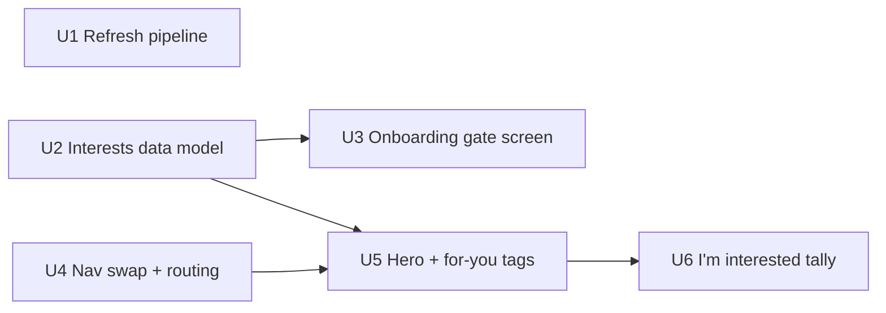

# Personalized Events tab

## Summary

Give `journey/events.jac` a native jaclang `@schedule` job that refreshes its data from U-M's
public events feed, then promote Events to its own bottom-nav tab (replacing the dead "Housing"
slot) with a one-time post-signup interest pick, a "today's pick" hero on the events screen, "for
you" tags on the existing list, and a `ReplyTick`-style "I'm interested" tally. Interest data lives
in a new journey-owned node, following the same per-student-on-their-own-root shape as
`TaskProgress`, so nothing here touches `core/profile.jac` or `market/`.

---

## Problem Frame

See origin document for the full problem frame. In short: the events feed's data is a one-time
static export with no refresh path, the "Housing" bottom-nav slot has never been routed to
anything, and every student sees the identical event list with no notion of what they personally
care about.

Two things surfaced during research that revise the origin document's assumptions: there is no
existing onboarding wizard to extend (resolved this session — see Open Questions), and the
"Housing" nav slot's target route (`/events`) doesn't exist yet in `main.jac`'s routing, so the nav
swap needs a small routing addition, not just a `NAV_ITEMS` edit.

---

## Requirements

- R1. `journey/events.jac`'s event data must be refreshable on a recurring schedule from a live
  source, without changing `all_events()`'s parsing/caching logic.
- R2. The refresh pulls from events.umich.edu's public Localist-powered JSON feed
  (events.umich.edu/feeds), not a manual export.
- R3. `NAV_ITEMS` in `ui/components/base.jac` replaces "Housing" with "Events".
- R4. Housing gets no dedicated screen; it stays a `market/` category, unchanged.
- R5. A student picks a small set of interest categories once, from the same taxonomy the events
  screen already filters by.
- R6. Interest matching is deterministic tag matching — no AI/LLM ranking.
- R7. The Events screen leads with a hero: the soonest event matching the student's interests,
  falling back to the soonest event overall (untagged) when nothing matches.
- R8. The existing day-grouped list keeps working, with "for you" tags on matching entries.
- R9. Existing category/free filters and the list/map toggle are preserved.
- R10. Each event shows an "N students interested" count.
- R11. A student can mark "I'm interested" on the hero event, incrementing that count as a
  throwaway tally with no per-student memory.

**Origin acceptance examples:** AE1 (covers R7), AE2 (covers R7), AE3 (covers R11)

---

## Scope Boundaries

- Implicit/behavioral interest learning — not in this pass; onboarding pick is the only signal.
- Richer visual treatment (category cover art/icons) — not in this pass.
- A dedicated Housing hub or screen — not being built.
- A browsable "past events" / archive view — not requested.
- Real per-student RSVP memory for "I'm interested" — set aside for a throwaway tally.
- An agenda-first layout with no separate hero — reviewed and set aside for the hero-led direction.
- Enforcing the interest pick on every route — it's a one-time post-signup redirect, not a global
  gate; a student who navigates away mid-gate isn't blocked elsewhere (U5's fallback logic already
  handles "no interests set" gracefully).
- Keeping `/journey/events` alive as an alias once the canonical route moves to `/events` — the one
  internal link that points at it (the map's venue-pin `href`) is updated in place instead.

---

## Context & Research

### Relevant Code and Patterns

- `journey/events.jac` — `EVENT_FILE`, `_cache` (mtime-keyed), `CATEGORY_RULES`, `EventView`,
  `parse_events()`, `all_events()`, `upcoming_events()` (`def:protect`). This is where refresh and
  matching logic land.
- `journey/screens/events.jac` — the `Events` component; currently wrapped in
  `<AppShell title="Events" active="journey" wide={True}><JourneyTabs active="/journey/events"/>`.
  The hero, "for you" tags, and tally UI land here; the `AppShell` `active` prop and the
  `JourneyTabs` line both change.
- `journey/walkers.jac` — `TaskProgress` (`has tid, checked, done`), the existing pattern for a
  node owned by a single student on their own root. The new `Interests` node follows this shape.
- `core/groups.jac` — `Membership` (`has group_id, member_root`, `AccessLevel.READ`), written
  alongside a private edge, counted by scanning `root.shared`; `is_member()` guards against
  double-join. This is the *checked* public-node pattern — not the one used here, but the
  reference point for why `ReplyTick` (below) was chosen instead.
- `market/graph.jac` — `ReplyTick` (`has post_id, kind`, `AccessLevel.READ`), created fire-and-forget
  with no identity and no pre-check (`market/messages.jac`), counted by `reply_counts()`. This is
  the direct analog for the "I'm interested" tally: no identity, no dedup, matching R11's "no
  memory of which student clicked."
- `market/notify.jac` — `email_sweep`, decorated `@schedule(trigger=ScheduleTrigger.STATIC,
  interval=NOTIFY_INTERVAL_SECONDS)`, imported into `main.jac` so the scheduler registers it. This
  is the exact mechanism the refresh job reuses.
- `core/profile.jac` — `HOUSING_STATUSES` / `profile_error()` pattern for a validated enum-like
  field, and `retry_on_conflict()` (a helper built after two real serialization-conflict
  incidents — commits `fd6f68c`, `b364022`). Referenced for context; not reused directly since the
  interest node and the tally node don't do the same scan-then-write `root.shared` pattern that
  caused those incidents (see Key Technical Decisions).
- `core/screens/welcome.jac` — `claim_umich_account`, `next_path()`. The post-signup redirect to the
  interests gate hooks in here.
- `ui/components/base.jac` — `NAV_ITEMS` (flat `list[tuple[key, label]]`); `AppShell`'s bottom nav
  derives each link's `href` mechanically as `"/" + key`, so adding "events" to `NAV_ITEMS` requires
  a matching `/events` route in `main.jac`.
- `main.jac` — flat `if/elif` on `current_path()`; currently routes `/journey/events` to `<Events/>`
  and imports `email_sweep` for scheduler registration (line ~63).
- `interop/email_sender.py` — the template for wrapping a non-Jac dependency, referenced only to
  confirm it is *not* needed here (see Key Technical Decisions).

### Institutional Learnings

- `docs/solutions/` does not exist in this repo; no institutional-learnings docs to draw from.
- CLAUDE.md's jaclang 0.37 gotchas apply directly: client screens must use `len(xs) > 0` /
  `len(xs) == 0`, never `if xs`, for lists; client reads are cached 60s, so the "I'm interested" tap
  needs a `heartbeat()`-style write before the count re-reads fresh; a client-imported helper module
  must be `def:pub`; an omitted `str | None` parameter arrives as the literal string `"None"`.
- Shared local Postgres pooling (256 connections, 5-minute idle pooling per test DB) means any new
  tests here run via `bash scripts/test.sh`, never raw `jac test -d .`.
- Served-app test files use the `_flow_tests.jac` or `_tests.jac` suffix, never `test_*.jac`; see
  `journey/journey_flow_tests.jac`'s `served()`/`call()` helper pattern, including
  `UARRIVED_DEV_MODE` / `UARRIVED_AI_OFF` env vars and the existing served test for
  `upcoming_events` using `UARRIVED_TODAY`.

### External References

- events.umich.edu/feeds — U-M's own documentation of its public Localist-powered JSON feed
  (RSS/iCal/JSON/CSV). No authentication documented.

---

## Key Technical Decisions

- **Refresh via jaclang's native `@schedule` decorator, not external cron/GitHub Actions/scripts**:
  `market/notify.jac`'s `email_sweep` already establishes this exact pattern in this codebase, gets
  an at-most-one-replica guarantee per tick for free when a DB is configured, and needs zero new
  infrastructure.
- **HTTP fetch stays in plain Jac (stdlib), not `interop/`**: `journey/events.jac` already imports
  `os`/`json`/`html`/`re` directly in a `.jac` file; rule 2 ("non-Jac source lives only in
  `interop/`") is about logic Jac itself can't express, not stdlib calls. A plain GET request
  doesn't need Python. Flagged as a feasibility check in Open Questions rather than a settled fact.
- **Atomic write-temp-then-rename for the refreshed file**: the current design was never at risk
  because the file was only ever written once, by hand. Once a recurring writer exists, a
  concurrent reader must never observe a torn/partial JSON file — `all_events()`'s
  `os.path.getmtime()` cache already handles picking up a new file with zero changes needed on the
  read side.
- **Interest data lives in a new `journey/interests.jac` module, not `core/profile.jac`**:
  `market/` never imports `journey/` (rule 3) and `core/` changes need both feature leads' sign-off
  (rule 6) for what is a journey-only concern. Follows `TaskProgress`'s existing "node per student
  on their own root" shape rather than extending `update_my_profile()`'s `TEXT_FIELDS`/`FLAG_FIELDS`
  whitelist, which has no list-typed bucket today.
- **Interest pick is a one-time post-signup redirect, not a global per-route gate**: matches R5's
  "once" framing with the smallest possible change to `main.jac`'s flat routing. The accepted gap —
  a student could navigate away mid-gate — is covered by U5's fallback (soonest-event-overall)
  behaving identically whether interests are merely unmatched or entirely unset.
- **"I'm interested" is a `ReplyTick`-style fire-and-forget tally, not a `Membership`-style checked
  join**: matches R11's explicit "no memory of which student clicked." Double-tap inflation is an
  accepted minor risk; a client-side-only "already tapped this page load" disable reduces accidental
  repeats without reintroducing per-student tracking. Because the write is unconditional (no
  scan-then-write of `root.shared` first, unlike `Membership.join()`), it doesn't need
  `retry_on_conflict()` wrapping the way the two prior serialization-conflict incidents did.
- **Journey's internal sub-tab strip (`JourneyTabs`) is dropped from the promoted Events screen**:
  confirmed this session — Events is now a bottom-nav peer of Journey, not a child of it.

---

## Open Questions

### Resolved During Planning

- Refresh trigger mechanism: jaclang's native `@schedule` cron decorator (origin left this
  "Deferred to Planning").
- Interest data location: new `journey/interests.jac` module, `TaskProgress`-style node (origin
  left this "Deferred to Planning").
- "I'm interested" tally shape: `ReplyTick`-style, no dedup (origin left this "Deferred to
  Planning").
- Where the one-time interest pick happens: a new gate screen shown once right after signup,
  before `/today` (origin had wrongly assumed an existing onboarding wizard to extend).
- Whether Journey's sub-tab strip persists inside the promoted Events screen: dropped.

### Deferred to Implementation

- [Needs research] Confirm events.umich.edu's JSON feed actually returns fields matching
  `parse_events()`'s expectations (`date_start`, `date_end`, `combined_title`, `event_type`,
  `tags`, `location_name`, `sponsors`, `cost`, `permalink`), and that a direct fetch succeeds from
  wherever the scheduled function actually runs — a fetch attempt during planning returned HTTP
  403, most likely bot protection rather than a real auth wall (carried forward from origin,
  unresolved).
- [Technical] Confirm plain stdlib `urllib` works cleanly from a `.jac` file for an HTTPS GET with a
  normal `User-Agent` header (needed to avoid the same 403 seen during planning); fall back to a
  small `interop/` Python script only if this genuinely doesn't work in Jac.
- Exact cron schedule (e.g., a fixed daily UTC hour) — any coarse daily-ish cadence satisfies R1;
  pick a specific time during implementation.

---

## Implementation Units

Dependency shape (U1 is independent; U4's nav/routing change and U2's data model both feed U5,
which U6 builds on):

---

### U1. Refresh pipeline

**Goal:** Keep `journey/umich_event_data` current from events.umich.edu's public JSON feed on a
recurring schedule, with no change to `all_events()`/`parse_events()`.

**Requirements:** R1, R2

**Dependencies:** None

**Files:**
- Create: `journey/events_refresh.jac`
- Modify: `main.jac` (import the new scheduled function so it registers, mirroring `email_sweep`)
- Test: `journey/events_refresh_tests.jac`

**Approach:**
- A `@schedule(trigger=ScheduleTrigger.CRON, cron="<daily UTC time>")`-decorated function fetches
  the Localist JSON feed, writes it to a temp file beside `EVENT_FILE`, then atomically replaces
  `EVENT_FILE` (`os.replace`) so `all_events()`'s `os.path.getmtime()` cache picks it up on the next
  read with zero changes to that function.
- Make the fetch function injectable/overridable (mirroring `interop/email_sender.py`'s test-double
  pattern) so tests can supply a fixture response instead of hitting the network.
- On any failure (network error, non-200, malformed JSON, schema that doesn't parse), leave the
  existing file untouched and do not propagate an exception that could crash the scheduler tick.

**Patterns to follow:**
- `market/notify.jac`'s `email_sweep` for the `@schedule` decorator usage and its `main.jac` import
  registration.
- `journey/events.jac`'s existing direct stdlib imports (`os`, `json`) for the fetch/write code.

**Test scenarios:**
- Happy path: given a well-formed fixture feed response, the refresh writes a file whose
  `parse_events()` output includes the fixture's event.
- Edge case: the feed returns valid JSON with an unexpected/empty schema — the existing file is
  left untouched.
- Error path: the fetch raises (network failure) — the existing file is left untouched and no
  exception escapes the scheduled function.
- Integration: after a successful refresh, `all_events()` reflects the new file's content without
  any change to its own caching or parsing logic (confirms R1's premise).

**Verification:**
- Invoking the refresh function directly with a fixture URL/response swaps the file and
  `all_events()` reflects it on the next call, with the previous file's content gone.
- A failed fetch leaves `journey/umich_event_data`'s mtime and content unchanged.

---

### U2. Interests data model

**Goal:** Let a student's picked interest categories be stored and read, owned entirely by
`journey/`.

**Requirements:** R5 (data side)

**Dependencies:** None

**Files:**
- Create: `journey/interests.jac`
- Test: inline `test "..." { }` blocks in `journey/interests.jac`

**Approach:**
- One `Interests` node (`has categories: list[str] = []`) per student, on their own root — the same
  shape as `TaskProgress` in `journey/walkers.jac`.
- `set_interests(categories: list[str])` writes (overwrites, not accumulates) the student's node.
- `my_interests() -> list[str]` and `has_interests() -> bool` for reading.
- Reuse `journey/constants.jac`'s `EVENT_CATEGORIES` as the taxonomy source, so the onboarding
  picker and the events screen's existing category filter never drift apart.

**Patterns to follow:**
- `journey/walkers.jac`'s `TaskProgress` for the per-student-own-root node shape and traversal
  style (`[root-->][?:NodeType]`).

**Test scenarios:**
- Happy path: `set_interests(["Arts", "Social"])` then `my_interests()` returns exactly
  `["Arts", "Social"]`.
- Edge case: `has_interests()` is `False` before any interests are set, `True` after.
- Edge case: calling `set_interests()` a second time overwrites rather than duplicating — the
  student ends up with exactly one `Interests` node, not two.

**Verification:**
- A student who has never called `set_interests()` reads `has_interests() == False` and
  `my_interests() == []`.

---

### U3. Onboarding gate screen

**Goal:** Prompt a student to pick interests once, right after signup, before they reach `/today`.

**Requirements:** R5 (UX side)

**Dependencies:** U2

**Files:**
- Create: `journey/screens/interests.jac`
- Modify: `core/screens/welcome.jac` (route to the interests gate instead of `next_path()` directly
  when `has_interests()` is `False` right after `claim_umich_account` succeeds)
- Test: `journey/journey_flow_tests.jac` (extend with a served scenario)

**Approach:**
- A single screen using the existing `Chip` component (`ui/components/blocks.jac`) for multi-select
  against `EVENT_CATEGORIES`, calling `set_interests()` on submit, then continuing to the original
  `next_path()`.
- This is a one-time redirect at signup, not a gate enforced on every route (see Key Technical
  Decisions) — a student who already has interests set (e.g., logging back in) skips straight past
  it.

**Patterns to follow:**
- `ui/components/blocks.jac`'s `Chip` (multi-select toggle pattern) and `SelectableCard` for the
  picker UI.
- `core/screens/welcome.jac`'s existing `next_path()` redirect logic for where to hook in.

**Test scenarios:**
- Happy path: after signup, a student with `has_interests() == False` is routed to the interests
  screen instead of `/today`.
- Happy path: submitting the picker calls `set_interests()` and then proceeds to the original
  `next_path()` target.
- Edge case: a student who already has interests set (re-logging in) skips the gate entirely.

**Verification:**
- A fresh signup with no interests set lands on the interests screen, not `/today`; submitting it
  lands on `/today` (or the original requested path) with interests now readable via `my_interests()`.

---

### U4. Nav swap and routing

**Goal:** Replace the dead "Housing" bottom-nav slot with a working "Events" tab.

**Requirements:** R3, R4

**Dependencies:** None (should land in its own small PR per rule 6 before U5 depends on the
screen's new home — see Risks & Dependencies)

**Files:**
- Modify: `ui/components/base.jac` (`NAV_ITEMS`: `("housing", "Housing")` → `("events", "Events")`)
- Modify: `main.jac` (add an `/events` route rendering `<Events/>`)
- Modify: `journey/screens/events.jac` (`AppShell`'s `active` prop: `"journey"` → `"events"`;
  remove the `<JourneyTabs active="/journey/events"/>` line per the confirmed decision to drop it;
  update the map's venue-pin `href` from `/journey/events?venue=...` to `/events?venue=...`)

**Approach:**
- `AppShell`'s bottom nav derives each link's `href` mechanically as `"/" + key`, so adding
  `"events"` to `NAV_ITEMS` requires the matching `/events` route to exist in `main.jac` — it
  doesn't today.
- No alias is kept at `/journey/events`; the one internal reference to it (the venue-pin deep link)
  is updated in place.

**Patterns to follow:**
- `main.jac`'s existing flat `if/elif` routing style.

**Test scenarios:**
- Happy path: `NAV_ITEMS` no longer contains `"housing"`; contains `"events"`.
- Happy path: visiting `/events` renders the Events screen with `"events"` as the highlighted nav
  item.
- Edge case: the venue-pin deep link (`?venue=`) still filters correctly under the new `/events`
  path.
- Integration: Housing's existing behavior as a `market/` post category (drafting, matching,
  expiry) is unaffected — existing `market/` tests continue to pass unmodified.

**Verification:**
- `/events` and `/events?venue=<name>` both render correctly; the bottom nav shows "Events" where
  "Housing" used to be, with no dangling reference to the old label anywhere in `ui/` or `journey/`.

---

### U5. Hero, "for you" tags, and fallback

**Goal:** Make the Events screen lead with a personalized hero and tag matching entries in the
existing list.

**Requirements:** R6, R7, R8, R9

**Dependencies:** U2, U4

**Files:**
- Modify: `journey/events.jac` (add a deterministic matching helper, e.g. a function returning the
  soonest upcoming event whose `category` is in the student's interests, or `None` if none match)
- Modify: `journey/screens/events.jac` (render the hero above the existing day-grouped list using
  the match result, falling back to the soonest event overall when there's no match; add "for you"
  tags to matching list entries using the same helper's logic)
- Test: `journey/events.jac`'s existing in-file test block (extend), plus
  `journey/journey_flow_tests.jac`

**Approach:**
- The hero and the list's "for you" tags must use the exact same matching function, so there's no
  divergence between what the hero highlights and what the list tags.
- Existing category/free filters and the list/map toggle are untouched (R9) — the hero and tags are
  additive to the current screen, not a replacement of it.

**Test scenarios:**
- Happy path (Covers AE1): given interests `["Arts", "Social"]`, the hero shows the soonest
  upcoming event tagged Arts or Social, not simply the soonest event overall.
- Edge case (Covers AE2): given no upcoming event matches any picked interest, the hero shows the
  soonest event overall, with no "for you" tag on it.
- Edge case: a student with no interests set at all (shouldn't reach this screen without passing
  U3's gate, but handled defensively) gets the same "soonest overall" fallback as the no-match case.
- Integration: list entries below the hero carry "for you" tags using the identical matching logic
  the hero uses — no separate, divergent rule.

**Verification:**
- Manually setting a student's interests and observing the hero/list against a fixed set of sample
  events matches AE1/AE2's expected outcomes exactly.

---

### U6. "I'm interested" tally

**Goal:** Add a lightweight, public "N students interested" count per event.

**Requirements:** R10, R11

**Dependencies:** U5

**Files:**
- Create: `journey/events_interest.jac` (an `EventInterest` node, `has eid: str`,
  `AccessLevel.READ`, and an `interest_count(eid)` reader — both mirroring `market/graph.jac`'s
  `ReplyTick`/`reply_counts()`)
- Modify: `journey/screens/events.jac` (display the count on the hero and list cards; add an "I'm
  interested" tap action on the hero that creates an `EventInterest` node and triggers a
  `heartbeat()`-style write so the refreshed count reads back within the client's 60s cache window)
- Test: inline `test "..." { }` blocks in `journey/events_interest.jac`, plus a served scenario in
  `journey/journey_flow_tests.jac`

**Approach:**
- The write is unconditional and fire-and-forget — no pre-check, no identity, no dedup — matching
  `ReplyTick`'s exact shape and R11's "no memory of which student clicked."
- A client-side-only "already tapped this page load" disable on the button reduces accidental
  double-taps without adding any server-side tracking.

**Test scenarios:**
- Happy path (Covers AE3): tapping "I'm interested" on an event showing "12 students interested"
  makes it read "13" for any subsequent viewer.
- Edge case: tapping the button twice in the same page load sends only one write (client-side
  guard); a second real page load can tap again — an accepted, intentional trade-off, not a bug.
- Integration: the count read-back reflects the new tally within the same session despite the
  client's 60s read cache, via the `heartbeat()`-style write.

**Verification:**
- Creating an `EventInterest` node for an event increments that event's `interest_count()` by
  exactly one; the events screen shows the updated count after tapping, without a page reload.

---

## System-Wide Impact

- **Interaction graph:** `main.jac` gains a new scheduled-function import (for U1's registration)
  and a new `/events` route (U4); `ui/components/base.jac`'s `NAV_ITEMS` is a shared, both-leads-
  owned file per rule 6.
- **Error propagation:** Refresh failures (U1) must never surface to students or crash the
  scheduler tick — they're invisible except via server logs, with the previous file left intact.
- **State lifecycle risks:** Atomic write-temp-then-rename (U1) avoids torn reads of the event
  file; the no-dedup tally (U6) can be inflated by repeated taps (accepted); `Interests` (U2) is
  overwrite-only, never accumulating multiple nodes per student.
- **API surface parity:** None outside this app; the only surface move is `/journey/events` →
  `/events`.
- **Integration coverage:** The full chain — signup → interests gate → Events screen shows a
  matching hero → tapping "I'm interested" increments the count — is the one scenario unit tests
  alone won't prove; cover it with one served flow test spanning U3, U5, and U6.
- **Unchanged invariants:** `all_events()`/`parse_events()`/`upcoming_events()`'s signatures and
  caching behavior are untouched; existing category/free filters and the list/map toggle keep
  working exactly as today; Housing's `market/` category behavior (drafting, matching, expiry) is
  completely unchanged.

---

## Risks & Dependencies

| Risk | Mitigation |
|------|------------|
| events.umich.edu's feed fetch may fail (403/bot protection) from the actual runtime environment, as it did during planning | Verify early in implementation with a real request from the deploy target; the old static file remains a safe fallback if refresh never succeeds |
| `ui/components/base.jac` is a shared, both-leads-owned file (rule 6) | Land U4's `NAV_ITEMS` change as its own small PR first, per the project's existing convention, before U5/U6 depend on the screen's new home |
| No-dedup "I'm interested" tally can be inflated by repeated taps | Accepted for this pass; client-side single-tap-per-load guard reduces accidental repeats; a real per-student cap would require the RSVP model explicitly set aside in brainstorming |
| Scheduled refresh writes could race a concurrent read of `journey/umich_event_data` | Atomic write-temp-then-rename avoids torn reads; jaclang's scheduler already guarantees at most one replica runs a given tick when a DB is configured |

---

## Documentation / Operational Notes

- No new environment variables. If the team wants the refresh cadence documented for operators,
  note the cron schedule in `docs/RUNNING_AND_DEPLOYING.md` — optional, not required for this plan.

---

## Sources & References

- **Origin document:** [docs/brainstorms/2026-09-27-005-personalized-events-tab-requirements.md](../brainstorms/2026-09-27-005-personalized-events-tab-requirements.md)
- Related code: `journey/events.jac`, `journey/screens/events.jac`, `journey/walkers.jac`,
  `journey/constants.jac`, `ui/components/base.jac`, `main.jac`, `core/screens/welcome.jac`,
  `core/profile.jac`, `core/groups.jac`, `market/graph.jac`, `market/notify.jac`
- External docs: events.umich.edu/feeds
